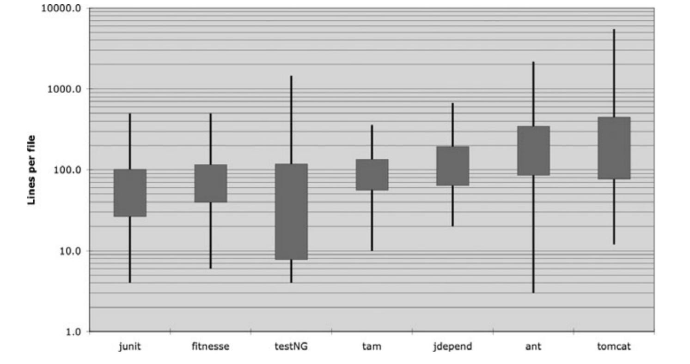
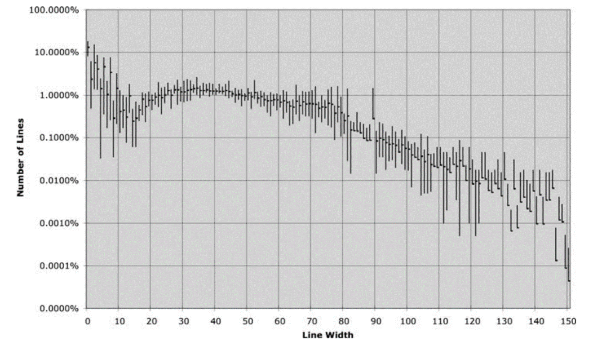

## CHƯƠNG 5: ĐỊNH DẠNG CODE

Khi mọi người tiến hành bảo dưỡng dự án, chúng tôi muốn họ ấn tượng bởi sự gọn gàng, nhất quán, và chú ý đến từng chi tiết mà chúng tôi đã tạo ra. Chúng tôi muốn họ choáng ngợp bởi sự ngăn nắp. Chúng tôi muốn họ phải bất ngờ khi xem qua các module. Chúng tôi muốn họ nhận thức được rằng chúng tôi chuyên nghiệp, và đây là sản phẩm được tạo ra bởi chuyên gia. Nhưng nếu điều đó không xảy ra, nếu họ nhìn thấy "một đống" code tứ tung, cứ như thể đống code đó được tạo ra trong cơn phê sau khi lập trình viên hút cần, thì nhiều khả năng họ kết luận rằng những chi tiết cẩu thả tương tự sẽ xuất hiện đầy rẫy trong dự án.

Bạn nên để tâm đến việc định dạng code của bạn. Bạn cũng nên chọn ra một tập hợp các quy tắc định dạng đơn giản để áp dụng cho toàn bộ code của mình. Nếu bạn đang làm việc trong một nhóm thì cả nhóm nên thống nhất một bộ quy tắc định dạng chung và tất cả thành viên nên tuân thủ nó.

## Mục đích của việc định dạng

Đầu tiên, nó giúp code của bạn trở nên rõ ràng. Định dạng code là một việc quan trọng. Nó quá quan trọng để có thể bỏ qua, nó nên được xem xét một cách nghiêm túc. Việc định dạng code là vấn đề về việc giao tiếp giữa các lập trình viên. Đối với lập trình viên, đây phải là vấn đề được ưu tiên giải quyết trước nhất.

Nếu bạn cho rằng việc _làm cho sản phẩm hoạt động_ nên được ưu tiên cao nhất thì cuốn sách này đã, đang và sẽ làm bạn thất vọng với suy nghĩ đó. Chức năng bạn viết hôm nay có khả năng _được_ thay đổi vào ngày mai. Tôi dùng từ _được_ vì đó là những thay đổi tốt, giúp nâng cao hiệu suất hệ thống, giảm thời gian xử lý,... Và độ dễ đọc của code có ảnh hưởng sâu sắc đến các thay đổi đó. Kiểu viết code của bạn sẽ đặt tiền lệ ảnh hưởng đến các lập trình viên sau này tiếp xúc với hệ thống, ảnh hưởng đến khả năng bảo trì và nâng cấp. Mức độ ảnh hưởng có thể là rất lâu. Phong cách và cách định dạng code của bạn vẫn còn sót lại trong hệ thống, dù cho code của bạn không còn.

Vậy hãy xem chúng ta có những biện pháp nào cho vấn đề này.

## Định dạng theo chiều dọc

Bắt đầu với kích thước file. Một file nên có kích thước như thế nào? Trong Java, kích thước file gắn liền với kích thước của class. Chúng tôi sẽ nói về kích thước của class khi đề cập đến chúng. Hiện tại chỉ cần quan tâm đến kích thước file.

Kích thước phổ biến của một file mã nguồn Java là bao nhiêu? Chúng tôi nhận thấy rằng có một loạt các kích cỡ và sự khác biệt đáng chú ý trong các hình thức khác nhau của Java. Hình 5.1 cho thấy một vài trong số đó.

Có bảy dự án khác nhau được mô tả. Junit, FitNesse, testNG, Time and Money (tam), JDepend, Ant, và Tomcat. Đường kẻ đen xuyên qua hình chữ nhật biểu thị số dòng lớn nhất, nhỏ nhất trong mỗi file nguồn. Hình chữ nhật biểu thị cho khoảng 1/3 giá trị phổ biến nhất. Khoảng giữa hình chữ nhật là giá trị trung bình. Ví dụ với dự án FitNesse, kích thước tệp trung bình của loại dự án này là 65 dòng, đa số nằm trong khoảng 40 đến 100+ dòng. File lớn nhất trong dự án có kích thước khoảng 400 dòng, nhỏ nhất là 6 dòng. Xin lưu ý rằng đây là thang đo log, do đó, sự khác biệt nhỏ về chiều dọc cũng đủ để tạo ra thay đổi rất lớn về kích thước trong thực tế.



_Hình 5.1 Độ dài tệp trong một số dự án_

Junit, FitNesse, và Time and Money (tam) bao gồm các file tương đối nhỏ. Không có file nào vượt quá 500 dòng và đa số các file dưới 200 dòng. Mặt khác, Tomcat và Ant có các file dài vài nghìn dòng và gần một nửa các file dài hơn 200 dòng.

Điều này có ý nghĩa gì? Các file lớn, thường dài 200-500 dòng chứng tỏ rằng chúng được xây dụng cho các hệ thống quan trọng. Mặc đù đây không phải là một quy tắc bất di bất dịch, nhưng nó nên được xem xét. Các file nhỏ luôn dễ hiểu hơn các file dài.

### "Hành code" như nhà báo hành văn

Hãy nghĩ về các bài báo mà bạn vẫn đọc thường ngày. Bạn đọc nó từ trên xuống, theo chiều dọc. Ngay từ đầu, tiêu đề bài báo sẽ cho bạn biết câu chuyện nói về vấn đề gì và cho phép bạn quyết định có đọc tiếp hay không. Ngay dưới tiêu đề là một bản tóm lược nội dung vấn đề và cung cấp cho bạn các mô tả chung chung. Khi bạn đọc tiếp, các chi tiết sẽ dần lộ diện cho đến khi bạn có tất cả các thông tin bao gồm ngày, tên, trích dẫn, các vấn đề quan trọng hay các sự kiện bên lề khác.

Chúng tôi muốn file mã nguồn được viết giống như một bài báo. Tên file nên đơn giản nhưng có khả năng giải thích. Bản thân tên file phải cho chúng tôi biết liệu chúng tôi có đang ở đúng vị trí cần xem xét hay không. Những dòng đầu tiên của file mã nguồn sẽ cung cấp các khái niệm và thuật toán. Mọi thứ sẽ dần sáng tỏ khi chúng tôi cuộn chuột xuống. Cuối cùng, chúng tôi muốn nhìn thấy các hàm với mức độ thấp nhất ở cuối file.

Một tờ báo bao gồm nhiều bài báo; hầu hết là rất nhỏ. Một số thì lớn hơn một chút. Rất hiếm khi chứa nhiều chữ như một trang truyện dài. Điều này làm cho tờ báo hữu dụng. Nếu tờ báo chỉ là một tập hợp các câu chuyện dài và ngày tháng, được sắp xếp một cách vô tổ chức thì sẽ chẳng ai thèm đọc chúng.

### Khoảng cách giữa các định nghĩa

Gần như tất cả code của bạn được đọc từ trái qua phải, từ trên xuống dưới. Mỗi dòng đại diện cho một biểu thức hoặc một mệnh đề, và mỗi nhóm dòng đại diện cho một mạch logic hoàn chỉnh. Những định nghĩa đó nên được tách biệt với nhau bằng những dòng trống.

Hãy xem qua ví dụ trong Listing 5-1, có các dòng trống phân tách giữa khai báo package, lệnh import và các hàm. Quy tắc cực kỳ đơn giản này có ảnh hưởng rất lớn đến bố cục trực quan của code. Mỗi dòng trống là một dấu hiệu để người đọc xác định một khái niệm mới và riêng biệt. Khi bạn lướt qua Listing 5-1, mắt bạn bị hút vào dòng đầu tiên ngay sau dòng trống.

| Listing 5-1 **BoldWidget.java** |
| --- |
```java
package fitnesse.wikitext.widgets;

import java.util.regex.*;

public class BoldWidget extends ParentWidget {
    public static final String REGEXP = "'''.+?'''";
    private static final Pattern pattern = Pattern.compile("'''(.+?)'''",
        Pattern.MULTILINE + Pattern.DOTALL
    );

    public BoldWidget(ParentWidget parent, String text) throws Exception {
        super(parent);
        Matcher match = pattern.matcher(text);
        match.find();
        addChildWidgets(match.group(1));
    }
    
    public String render() throws Exception {
        StringBuffer html = new StringBuffer("<b>");
        html.append(childHtml()).append("</b>");
        return html.toString();
    }
}
```

Lấy các dòng trống đó ra, code của bạn làm người đọc đau đầu và đau cả mắt như trong Listing 5-2 dưới đây:

| Listing 5-2 **BoldWidget.java** |
| --- |
```java
package fitnesse.wikitext.widgets;
import java.util.regex.*;
public class BoldWidget extends ParentWidget {
    public static final String REGEXP = "'''.+?'''";
    private static final Pattern pattern = Pattern.compile("'''(.+?)'''",
        Pattern.MULTILINE + Pattern.DOTALL);
    public BoldWidget(ParentWidget parent, String text) throws Exception {
        super(parent);
        Matcher match = pattern.matcher(text);
        match.find();
        addChildWidgets(match.group(1));}
    public String render() throws Exception {
        StringBuffer html = new StringBuffer("<b>");
        html.append(childHtml()).append("</b>");
        return html.toString();
    }
}
```

Hiệu ứng này thậm chí còn rõ rệt hơn khi bạn mất tập trung. Ở ví dụ đầu tiên, các nhóm dòng khác nhau xuất hiện rõ ràng và bạn có thể nắm bắt nó, trong khi ví dụ thứ 2 trông như một vũng lầy. Sự khác biệt giữa 2 ví dụ này chỉ là một vài lần nhấn phím Enter.

### Mật độ theo chiều dọc

Nếu khoảng cách dọc dùng để tách biệt các định nghĩa, thì mật độ theo chiều dọc nghĩa là sự liên kết các dòng của khái niệm/định nghĩa đó. Các dòng có liên quan với nhau sẽ xuất hiện liền nhau theo chiều dọc. Hãy xem các comment vô dụng trong Listing 5-3 phá vỡ sự kết hợp chặt chẽ của 2 biến như thế nào.

| Listing 5-3 |
| --- |
```java
public class ReporterConfig {
    /**
     * The class name of the reporter listener
     */
    private String m_className;

    /**
     * The properties of the reporter listener
     */
    private List<Property> m_properties = new ArrayList<Property>();

    public void addProperty(Property property) {
        m_properties.add(property);
    }
```

Listing 5-4 dễ đọc hơn nhiều. Trông nó rất "đã mắt", ít nhất là đối với tôi. Tôi có thể nhìn vào nó và biết ngay rằng đây là một class có hai biến và một phương thức mà không phải tốn sức đảo đầu và mắt. Phiên bản trước đó buộc tôi phải sử dụng đầu và mắt nhiều hơn để có được điều đó.

| Listing 5-4 |
| --- |
```java
public class ReporterConfig {
    private String m_className;
    private List<Property> m_properties = new ArrayList<Property>();

    public void addProperty(Property property) {
        m_properties.add(property);
    }
```

### Khoảng cách theo chiều dọc

Đã bao giờ bạn thấy mình như _dã tràng xe cát biển Đông_ chưa? Nhảy từ hàm này qua hàm khác, class này qua class khác, cuộn chuột lên xuống khắp các file mã nguồn, cố gắng phân loại các hàm và các biến, để rồi cuối cùng bị lạc trong mê lộ code. Bạn đã bao giờ mày mò ngược lên chuỗi kế thừa của class hiện tại chỉ để tìm hiểu định nghĩa của một hàm hay biến chưa? Điều này thật sự khó chịu vì bạn đang cố gắng hiểu hệ thống đang _làm gì_, nhưng lại mất thời gian để tìm xem các phần của hệ thống đang _ở đâu_.

Các định nghĩa có liên quan với nhau nên được giữ gần nhau theo chiều dọc. Rõ ràng quy tắc này không hoạt động với các file riêng biệt. Nhưng bạn cũng không nên tách các định nghĩa có liên quan với nhau thành các file khác nhau, trừ khi bạn có lý do rất chính đáng để làm điều đó. Lời khuyên chân thành dành cho bạn đây: các biến có phạm vi `protected` nên tránh điều tôi vừa nêu trên.

Đối với những định nghĩa có liên quan chặt chẽ trong cùng một file mã nguồn, khoảng cách giữa chúng nên trở thành thước đo quan trọng cho mức độ dễ hiểu của nhau. Chúng tôi không muốn các độc giả của chúng tôi phải đảo mắt hay cuộn chuột khắp file mã nguồn.

**Khai báo biến.** Các biến nên được khai báo càng gần với nơi sử dụng chúng càng tốt. Bởi vì hàm của chúng ta rất ngắn, nên các biến cục bộ phải được khai báo ở những dòng đầu tiên của mỗi hàm, như trong hàm dưới đây (hàm này hơi dài, tôi trích ra từ Junit 4.3.1).

```java
private static void readPreferences(){
    InputStream is = null;
    try{
        is = new FileInputStream(getPreferencesFile());
        setPreferences(new Properties(getPreferences()));
        getPreferences().load(is);
    }catch (IOException e){
        try{
            if (is != null)
                is.close();
        }catch (IOException e1){
        }
    }
}
```

Các biến điều khiển vòng lặp nên được khai báo trong vòng lặp, như ví dụ nhỏ xinh dưới đây (cũng trích từ Junit 4.3.1)

```java
public int countTestCases() {
    int count= 0;
    for (Test each : tests)
        count += each.countTestCases();
    return count;
}
```

Trong một vài trường hợp hiếm gặp, một biến có thể được khai báo ở đầu một khối lệnh hoặc ngay trước một vòng lặp trong một hàm-hơi-dài. Bạn có thể thấy một biến như vậy bên dưới, được trích từ một hàm-rất-dài trong TestNG.

```java
for (XmlTest test : m_suite.getTests()) {
    TestRunner tr = m_runnerFactory.newTestRunner(this, test);
    tr.addListener(m_textReporter);
    m_testRunners.add(tr);

    invoker = tr.getInvoker();
    
    for (ITestNGMethod m : tr.getBeforeSuiteMethods()) {
        beforeSuiteMethods.put(m.getMethod(), m);
    }
    for (ITestNGMethod m : tr.getAfterSuiteMethods()) {
        afterSuiteMethods.put(m.getMethod(), m);
    }
}
```

**Các biến instance**. Nên được khai báo ở đầu các class, và cũng không nên tạo khoảng cách giữa các biến này vì trong một class được thiết kế tốt, các biến instance được sử dụng bởi nhiều phương thức của class.

Đã có nhiều cuộc tranh luận về việc nên đặt các biến instance ở đâu. Trong C++, chúng tôi thường sử dụng quy tắc được gọi là _nguyên tắc cái kéo_, với việc đặt tất cả các biến instance ở cuối class. Tuy nhiên, quy ước chung trong Java là đặt tất cả chúng ở đầu. Tôi không thấy có lý do nào để tuân theo một nguyên tắc khác. Điều quan trọng là các biến instance phải được khai báo ở một nơi đủ "nổi tiếng" để mọi người dễ dàng tìm ra chúng.

Hãy xem xét một ví dụ lạ của class TestSuite trong JUnit 4.3.1. Tôi đã cố gắng rút gọn để bạn thấy được nó. Nếu bạn nhìn xuống khoảng giữa của class, bạn sẽ thấy hai biến instance được khai báo ở đó. Thật khó để đặt chúng ở một nơi tốt hơn. Khi ai đó đọc code họ sẽ phải thấy các khai báo này một cách tình cờ (như tôi đã từng làm).

```java
public class TestSuite implements Test {
    static public Test createTest(Class<? extends TestCase> theClass,
                String name) {
        ... 
    }

    public static Constructor<? extends TestCase>
    getTestConstructor(Class<? extends TestCase> theClass)
    throws NoSuchMethodException { 
        ... 
    }

    public static Test warning(final String message) {
        ...
    }

    private static String exceptionToString(Throwable t) {
        ...
    }

    private String fName;
    private Vector<Test> fTests= new Vector<Test>(10);

    public TestSuite() {
    }

    public TestSuite(final Class<? extends TestCase> theClass) {
        ...
    }

    public TestSuite(Class<? extends TestCase> theClass, String name) {
        ...
    }
    ... ... ... ... ...
}
```

**Các hàm phụ thuộc nhau**. Nếu một hàm gọi một hàm khác, chúng nên được đặt gần nhau. Và nếu có thể, hàm gọi nên ở trên hàm được gọi. Điều này mang lại cho chương trình một luồng dữ liệu tự nhiên. Nếu nguyên tắc này được tuân theo, các độc giả sẽ tin rằng nội dung của những hàm được gọi sẽ xuất hiện ngay sau khi họ thấy lời gọi chúng. Hãy xem xét ví dụ được trích từ FitNesse trong Listing 5-5. Lưu ý cách các hàm trên cùng gọi các hàm bên dưới nó và cách chúng lần lượt gọi các hàm khác bên dưới chúng. Việc sắp xếp này giúp bạn dễ dàng tìm thấy các hàm được gọi và tăng đáng kể khả năng đọc cho toàn bộ module.

| Listing 5-5 **WikiPageResponder.java** |
| --- |
```java
public class WikiPageResponder implements SecureResponder {
    protected WikiPage page;
    protected PageData pageData;
    protected String pageTitle;
    protected Request request;
    protected PageCrawler crawler;
    
    public Response makeResponse(FitNesseContext context, Request request)
    throws Exception {
        String pageName = getPageNameOrDefault(request, "FrontPage");
        loadPage(pageName, context);
        if (page == null)
            return notFoundResponse(context, request);
        else
            return makePageResponse(context);
    }
    private String getPageNameOrDefault(Request request, String defaultPageName)
    {
        String pageName = request.getResource();
        if (StringUtil.isBlank(pageName))
            pageName = defaultPageName;

        return pageName;
    }

    protected void loadPage(String resource, FitNesseContext context)
        throws Exception {
        WikiPagePath path = PathParser.parse(resource);
        crawler = context.root.getPageCrawler();
        crawler.setDeadEndStrategy(new VirtualEnabledPageCrawler());
        page = crawler.getPage(context.root, path);
        if (page != null)
            pageData = page.getData();
    }
    private Response notFoundResponse(FitNesseContext context, Request request)
        throws Exception {
        return new NotFoundResponder().makeResponse(context, request);
    }

    private SimpleResponse makePageResponse(FitNesseContext context)
        throws Exception {
        pageTitle = PathParser.render(crawler.getFullPath(page));
        String html = makeHtml(context);

        SimpleResponse response = new SimpleResponse();
        response.setMaxAge(0);
        response.setContent(html);
        return response;
    }
...
```

Bên cạnh đó, đoạn trích này cung cấp một ví dụ hay về việc giữ các hằng số ở mức thích hợp [G35]. Hằng số "FrontPage" có thể đã bị chôn vùi trong hàm getPageNameOrDefault, nhưng sẽ giúp ẩn đi một hằng số trong một hàm-cấp-thấp không phù hợp. Tốt hơn là nên đưa nó từ nơi mà nó có ý nghĩa đến nơi thật sự sử dụng nó.

**Các định nghĩa có liên quan**. Một vài phần của mã nguồn muốn ở gần các phần khác. Chúng có mối liên hệ nhất định. Mối quan hệ càng mạnh thì khoảng cách giữa chúng càng ít.

Như chúng ta đã thấy, mối quan hệ này có thể dựa trên sự phụ thuộc trực tiếp, như một hàm gọi một hàm khác hoặc một hàm sử dụng một biến, hoặc những nguyên nhân khác. Mối liên hệ này cũng có thể được tạo ra bởi vì một nhóm hàm thực thi một hành động tương tự nhau. Hãy xem xét đoạn code sau từ Junit 4.3.1:

```java
public class Assert {
    static public void assertTrue(String message, boolean condition) {
        if (!condition)
            fail(message);
    }

    static public void assertTrue(boolean condition) {
        assertTrue(null, condition);
    }

    static public void assertFalse(String message, boolean condition) {
        assertTrue(message, !condition);
    }
    
    static public void assertFalse(boolean condition) {
        assertFalse(null, condition);
    }
    ...
```

Các hàm này có mối liên hệ mạnh vì chúng có cùng một định dạng tên và thực hiện các biến thể của cùng một tác vụ. Việc chúng gọi nhau là hiển nhiên, ngay cả khi không, chúng vẫn nên ở gần nhau.

### Trật tự theo chiều dọc

Nói chung, chúng tôi muốn các lời gọi hàm phụ thuộc nhau theo hướng đi xuống, nghĩa là lời gọi hàm nên gọi đến một hàm bên dưới (hàm thực hiện lời gọi hàm đó). Điều này giúp tạo ra một luồng dữ liệu trong module mã nguồn từ cấp cao đến cấp thấp.

Như trong các bài báo, chúng tôi mong rằng các định nghĩa quan trọng nhất sẽ xuất hiện trước và chúng sẽ được miêu tả một cách súc tích, rõ ràng nhất. Chúng tôi cũng mong các chi tiết vụn vặt sẽ xuất hiện cuối cùng. Điều này cho phép chúng tôi đọc lướt qua các file mã nguồn, lấy ra một vài ý chính mà không cần phải lạc trôi vào các chi tiết. Listing 5-5 được tổ chức theo cách này, Listing 15-5 và Listing 3-7 cũng là các ví dụ tốt.

## Định dạng theo chiều ngang

Một dòng nên có độ rộng như thế nào? Để trả lời điều đó, chúng ta hãy cùng xem độ rộng các dòng trong các chương trình điển hình. Một lần nữa, chúng tôi xem xét bảy dự án khác nhau. Hình 5-2 cho thấy sự phân phối kích thước dòng của cả bảy dự án. Có một sự đều đặn ở đây, đặc biệt là xung quanh mức 45 ký tự. Thật vậy, có khoảng 1% số dòng có độ rộng từ 20-60 ký tự, chiếm 40% mã nguồn. Có khoảng 30% số dòng dưới 10 ký tự. Quá rõ ràng, các lập trình viên thích những dòng code ngắn!

Điều này cho thấy chúng ta nên cố gắng giữ các dòng code của chúng ta ngắn. Giới hạn cũ của Hollerith là 80 ký tự, và tôi không có ý kiến gì khi các dòng có thể vượt quá 100 hay 120 ký tự ở thời điểm hiện tại. Nhưng nhiều hơn số đó thì không hay chút nào.

Tôi đã từng tuân theo nguyên tắc rằng bạn sẽ không bao giờ phải cuộn chuột sang phải. Nhưng hiện nay màn hình đã rất rộng và các lập trình viên trẻ có thể thu nhỏ phông chữ đến mức họ có thể chứa 200 ký tự trên một dòng. Đừng làm thế. Cá nhân tôi đặt giới hạn của mình là 120.



_Hình 5.2 Phân bố kích thước một dòng trong Java_

### Khoảng cách và mật độ

Chúng tôi sử dụng khoảng trắng để tách biệt những thứ không liên quan lắm, điều đó cũng góp phần làm nổi bật những thứ có liên quan với nhau. Ví dụ như hàm dưới đây:

```java
private void measureLine(String line) {
    lineCount++;
    int lineSize = line.length();
    totalChars += lineSize;
    lineWidthHistogram.addLine(lineSize, lineCount);
    recordWidestLine(lineSize);
}
```

Chúng tôi bao quanh các toán tử gán bằng khoảng trắng để làm nổi bật chúng. Câu lệnh gán có hai yếu tố rõ ràng: vế trái và vế phải. Các khoảng trắng làm sự tách biệt này thêm rõ ràng.

Mặt khác, tôi không đặt khoảng trắng giữa tên hàm và dấu ngoặc đơn mở. Điều này là do hàm và các đối số của nó có liên quan chặt chẽ với nhau. Tách chúng ra làm mối liên kết đó bị yếu đi. Tôi tách các đối số trong lời gọi hàm để làm nổi bật chúng, giúp độc giả dễ nhận ra các đối số này là riêng biệt.

Một cách sử dùng khoảng trắng khác là làm nổi bật độ ưu tiên của các toán tử:

```java
public class Quadratic {
    public static double root1(double a, double b, double c) {
        double determinant = determinant(a, b, c);
        return (-b + Math.sqrt(determinant)) / (2*a);
    }

    public static double root2(int a, int b, int c) {
        double determinant = determinant(a, b, c);
        return (-b - Math.sqrt(determinant)) / (2*a);
    }
    
    private static double determinant(double a, double b, double c) {
        return b*b - 4*a*c;
    }
}
```

Hãy chú ý vào các biểu thức. Các hệ số (của phép nhân) không chứa khoảng trắng vì chúng có độ ưu tiên cao. Các số hạng được phân tách bởi khoảng trắng bởi vì phép cộng và phép trừ có độ ưu tiên thấp hơn.

Thật không may là, các công cụ tự động định dạng hiện tại đều không phân biệt được độ ưu tiên giữa các toán tử, và chúng áp cách khoảng trắng giống nhau cho các toán tử có độ ưu tiên khác nhau. Vì vậy, việc sử dụng khoảng trắng một cách tinh tế như ví dụ trên có xu hướng biến mất khi bạn dùng chức năng định dạng của IDE.

### Căn chỉnh theo chiều ngang

Khi tôi còn là một lập trình viên Assembly, tôi đã sử dụng biện pháp căn chỉnh theo chiều ngang để làm nổi bật một số cấu trúc nhất định. Khi tôi bắt đầu code bằng C, C++ và cuối cùng là Java, tôi vẫn cố gắng sắp xếp tất cả các tên biến vào một tập hợp các khai báo, hoặc tất cả các rvalue vào một tập hợp các câu lệnh gán. Code của tôi có thể trông như thế này:

```java
public class FitNesseExpediter implements ResponseSender
{
    private     Socket          socket;
    private     InputStream     input;
    private     OutputStream    output;
    private     Request         request;
    private     Response        response;
    private     FitNesseContext context;
    protected   long            requestParsingTimeLimit;
    private     long            requestProgress;
    private     long            requestParsingDeadline;
    private     boolean         hasError;

    public FitNesseExpediter(Socket s,
                    FitNesseContext context) throws Exception
    {
        this.context =              context;
        socket =                    s;
        input =                     s.getInputStream();
        output =                    s.getOutputStream();
        requestParsingTimeLimit =   10000;
    }
```

Tôi đã từng làm vậy, tuy nhiên, loại căn chỉnh này không hữu ích. Cách căn chỉnh này khiến bạn bị hút vào một nửa sự thật và quên mất nửa còn lại. Trong ví dụ trên, bạn có thể bị hút mắt vào tên biến mà không quan tâm đến kiểu dữ liệu của nó. Tương tự cho các câu lệnh gán, bạn bị hấp dẫn bởi các rvalue mà không cần nhìn đến toán tử gán. Để làm mọi thứ trở nên tệ hơn (?!), các công cụ định dạng tự động thường loại bỏ cách căn chỉnh này.

Vậy nên cuối cùng, tôi không dùng cách căn chỉnh này nữa. Ngày nay tôi thích các khai báo và lệnh gán không căn chỉnh ngang, như ví dụ dưới đây, vì chúng chỉ ra một vài khuyết điểm quan trọng. Nếu tôi có một danh sách dài các khai báo cần được căn chỉnh, vấn đề nằm ở _độ dài_ của chúng. Độ dài của các khai báo trong class FitNesseExpediter bên dưới cho thấy rằng lớp này nên được tách ra.

```java
public class FitNesseExpediter implements ResponseSender
{
    private Socket socket;
    private InputStream input;
    private OutputStream output;
    private Request request;
    private Response response;
    private FitNesseContext context;
    protected long requestParsingTimeLimit;
    private long requestProgress;
    private long requestParsingDeadline;
    private boolean hasError;

    public FitNesseExpediter(Socket s, FitNesseContext context) throws Exception
    {
        this.context = context;
        socket = s;
        input = s.getInputStream();
        output = s.getOutputStream();
        requestParsingTimeLimit = 10000;
    }
```

### Việc lùi đầu dòng

Một file mã nguồn nên giống một hệ thống hoàn chỉnh hơn là một bản phác thảo sơ sài. Sẽ có thông tin về toàn bộ file, thông tin về các class riêng lẻ trong file, thông tin về các khối lệnh của hàm và các khối lệnh con trong hàm. Mỗi cấp độ của hệ thống này tạo ra một phạm vi mà ở đó bạn có thể khai báo các biến, trong đó các khai báo và câu lệnh được thể hiện một cách rõ ràng.

Để làm cho hệ thống này trở nên rõ hơn với người đọc, chúng tôi lùi các dòng code tỉ lệ thuận với vị trí của chúng trong hệ thống phân cấp. Các câu lệnh ở cấp độ cao, ví dụ như khai báo class, hoàn toàn không lùi lề. Các phương thức trong một class được lùi vào một cấp. Các dòng lệnh thực hiện chức năng của phương thức được lùi vào một cấp so với dòng khai báo phương thức đó. Các khối lệnh cũng được lùi một cấp so với khối lệnh cha của chúng.

Các lập trình viên phụ thuộc rất nhiều vào sơ đồ lùi dòng này. Họ nhìn vào đầu dòng để xác định cấp độ của các dòng code trong hệ thống. Điều này cho phép họ nhanh chóng nhảy qua các khối lệnh, chẳng hạn như các khối lệnh if hoặc while không liên quan đến tình huống hiện tại. Họ lướt mắt về phía bên trái màn hình để thấy các phương thức mới, biến mới hay thậm chí là class mới. Nếu không thực hiện việc lùi đầu dòng, code của bạn không dành cho con người đọc.

Hãy xem hai đoạn code giống hệt nhau về mặt cú pháp và ngữ nghĩa dưới đây:

```java
public class FitNesseServer implements SocketServer { private FitNesseContext
context; public FitNesseServer(FitNesseContext context) { this.context =
context; } public void serve(Socket s) { serve(s, 10000); } public void
serve(Socket s, long requestTimeout) { try { FitNesseExpediter sender = new
FitNesseExpediter(s, context);
sender.setRequestParsingTimeLimit(requestTimeout); sender.start(); }
catch(Exception e) { e.printStackTrace(); } } }

-----

public class FitNesseServer implements SocketServer {
    private FitNesseContext context;

    public FitNesseServer(FitNesseContext context) {
        this.context = context;
    }

    public void serve(Socket s) {
        serve(s, 10000);
    }
    
    public void serve(Socket s, long requestTimeout) {
        try {
            FitNesseExpediter sender = new FitNesseExpediter(s, context);
            sender.setRequestParsingTimeLimit(requestTimeout);
            sender.start();
        }
        catch (Exception e) {
            e.printStackTrace();
        }
    }
}
```

Mắt của bạn có thể nhanh chóng phân biệt được các phần của một tập tin có cấu trúc lùi đầu dòng. Bạn gần như có thể ngay lập tức phát hiện ra các biến, constructor, và các phương thức [...]. Với phiên bản không căn chỉnh lùi dòng, bạn gần như không hiểu gì nếu không phải đổ mồ hôi sôi nước mắt tìm hiểu.

Bỏ qua các đoạn lùi dòng. Thỉnh thoảng tôi bị dụ dỗ phá vỡ các quy tắc về việc lùi đầu dòng, như các câu lệnh if ngắn, vòng lặp while ngắn hay các hàm ngắn. Bất cứ khi nào việc đó xảy ra, tôi hầu như luôn quay lại và đặt vào đó một khoảng lùi dòng. Vì vậy tôi luôn tránh thu hẹp các khối lệnh xuống còn một dòng như thế này:

```java
public class CommentWidget extends TextWidget
{
    public static final String REGEXP = "^#[^\r\n]*(?:(?:\r\n)|\n|\r)?";

    public CommentWidget(ParentWidget parent, String text){super(parent, text);}
    public String render() throws Exception {return ""; }
}
```

Thay vào đó, tôi thích viết chúng lại theo cách này:

```java
public class CommentWidget extends TextWidget
{
    public static final String REGEXP = "^#[^\r\n]*(?:(?:\r\n)|\n|\r)?";

    public CommentWidget(ParentWidget parent, String text){
        super(parent, text);
    }

    public String render() throws Exception {
        return ""; 
    }
}
```

### Những khoảng trống giả

Đôi khi phần thân của vòng lặp `while` hoặc vòng lặp `for` là một _thân giả_, như ví dụ dưới đây. Tôi không thích cấu trúc này và sẽ cố gắng tránh chúng. Nhưng khi tôi không thể tránh chúng, tôi phải chắc rằng phần thân giả của chúng được lùi vào đúng cách và được bao quanh bởi dấu ngoặc ôm. Tôi không thể nhớ nổi tôi đã bị lừa bao nhiêu lần bởi một dấu chấm phẩy lặng lẽ xuất hiện ở cuối vòng lặp, trên cùng một dòng. Trừ khi bạn làm cho dấu chấm phẩy đó _hiện hình_ bằng cách lùi dòng trên dòng riêng của nó, nếu không thì quá khó để nhìn thấy nó.

```java
while (dis.read(buf, 0, readBufferSize) != -1)
    ;
```

## Các quy tắc trong nhóm

Mỗi lập trình viên đều có bộ quy tắc định dạng yêu thích của riêng mình. Nhưng nếu anh ta làm việc trong một nhóm, thì nên tuân theo quy tắc nhóm.

Một nhóm các nhà phát triển nên đồng ý với một kiểu định dạng duy nhất và sau đó các thành viên nên áp dụng kiểu định dạng đó. Chúng tôi muốn phần mềm có một phong cách code duy nhất, chúng tôi không muốn nó trông như được viết bởi nhiều nhóm với nhiều kiểu định dạng khác nhau.

Khi tôi bắt đầu với một dự án FitNesse vào năm 2002, tôi đã ngồi lại với nhóm của mình để thống nhất phong cách code cho toàn dự án. Điều này mất khoảng 10 phút. Chúng tôi đã đưa ra quyết định về việc đặt các dấu ngoặc ôm ở đâu; tên class, tên biến và tên hàm sẽ được đặt như thế nào,... Sau đó chúng tôi gán các quy tắc đó vào bộ định dạng tùy chỉnh của IDE và gắn liền với chúng kể từ đó. Đây không phải là những quy tắc mà tôi thích, nhưng chúng đã được cả nhóm thống nhất với nhau. Là một thành viên của nhóm, tôi phải tuân thủ chúng khi tôi code trong dự án FitNesse.

Hãy nhớ rằng, một phần mềm tốt bao gồm một bộ tài liệu được thiết kế tốt và dễ đọc. Chúng cần phải có phong cách nhất quán và trơn tru. Người đọc tin rằng các định dạng mà họ thấy trong file mã nguồn sẽ có ý nghĩa tương tự ở một nơi khác.[...]

## Các quy tắc định dạng của Uncle Bob

Các quy tắc cá nhân tôi hay sử dụng rất đơn giản và được miêu tả bằng code trong Listing 5-6. Hãy xem như đây là ví dụ cho việc là thế nào để code nên những dòng code chuẩn.

| Listing 5-6 **CodeAnalyzer.java** |
| --- |
```java
public class CodeAnalyzer implements JavaFileAnalysis {
    private int lineCount;
    private int maxLineWidth;
    private int widestLineNumber;
    private LineWidthHistogram lineWidthHistogram;
    private int totalChars;

    public CodeAnalyzer() {
        lineWidthHistogram = new LineWidthHistogram();
    }

    public static List<File> findJavaFiles(File parentDirectory) {
        List<File> files = new ArrayList<File>();
        findJavaFiles(parentDirectory, files);
        return files;
    }

    private static void findJavaFiles(File parentDirectory, List<File> files) {
        for (File file : parentDirectory.listFiles()) {
            if (file.getName().endsWith(".java"))
                files.add(file);
            else if (file.isDirectory())
                findJavaFiles(file, files);
        }
    }

    public void analyzeFile(File javaFile) throws Exception {
        BufferedReader br = new BufferedReader(new FileReader(javaFile));
        String line;
        while ((line = br.readLine()) != null)
            measureLine(line);
    }

    private void measureLine(String line) {
        lineCount++;
        int lineSize = line.length();
        totalChars += lineSize;
        lineWidthHistogram.addLine(lineSize, lineCount);
        recordWidestLine(lineSize);
    }

    private void recordWidestLine(int lineSize) {
        if (lineSize > maxLineWidth) {
            maxLineWidth = lineSize;
            widestLineNumber = lineCount;
        }
    }

    public int getLineCount() {
        return lineCount;
    }

    public int getMaxLineWidth() {
        return maxLineWidth;
    }

    public int getWidestLineNumber() {
        return widestLineNumber;
    }

    public LineWidthHistogram getLineWidthHistogram() {
        return lineWidthHistogram;
    }

    public double getMeanLineWidth() {
        return (double)totalChars/lineCount;
    }

    public int getMedianLineWidth() {
        Integer[] sortedWidths = getSortedWidths();
        int cumulativeLineCount = 0;
        for (int width : sortedWidths) {
            cumulativeLineCount += lineCountForWidth(width);
            if (cumulativeLineCount > lineCount/2)
                return width;
        }
        throw new Error("Cannot get here");
    }

    private int lineCountForWidth(int width) {
        return lineWidthHistogram.getLinesforWidth(width).size();
    }

    private Integer[] getSortedWidths() {
        Set<Integer> widths = lineWidthHistogram.getWidths();
        Integer[] sortedWidths = (widths.toArray(new Integer[0]));
        Arrays.sort(sortedWidths);
        return sortedWidths;
    }
}

```