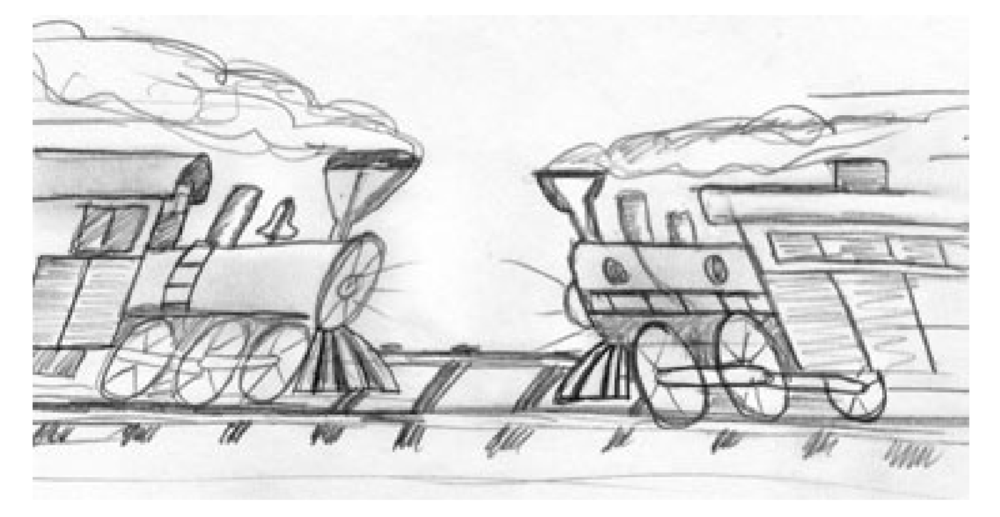

## CHƯƠNG 6: ĐỐI TƯỢNG VÀ CẤU TRÚC DỮ LIỆU

Chúng tôi có lý do khi muốn giữ các biến là private. Chúng tôi không muốn ai đó phụ thuộc vào chúng. Chúng tôi muốn giữ sự tự do để thay đổi kiểu (dữ liệu) hoặc thực hiện các hành động tùy biến. Nhưng sau đó thì sao? Rất nhiều lập trình viên tự động thêm getter và setter vào class của họ, chẳng khác gì thay đổi các biến `private` thành `public`.

## Trừu tượng hóa dữ liệu

Hãy xem xét sự khác biệt giữa Listing 6-1 và Listing 6-2. Cả hai đều đại diện cho dữ liệu của một điểm trong hệ tọa độ Descartes. Tuy nhiên, một cái thì để lộ việc triển khai trong khi cái còn lại thì không.

| Listing 6-1 **Concrete Point** |
| --- |
```java
public class Point {
    public double x;
    public double y;
}
```

| Listing 6-2 **Abstract Point** |
| --- |
```java
public interface Point {
    double getX();
    double getY();
    void setCartesian(double x, double y);
    double getR();
    double getTheta();
    void setPolar(double r, double theta);
}
```

Cái hay của Listing 6-2 là không có cách nào bạn biết được việc triển khai interface sẽ được dùng cho hình chữ nhật hay các góc tọa độ, hoặc không gì cả. `Interface` rõ ràng là một dạng cấu trúc dữ liệu.

Nhưng nó không chỉ là một dạng cấu trúc dữ liệu. Các phương thức tuân theo một chính sách truy cập duy nhất. Bạn có thể đọc các tọa độ riêng lẻ một cách độc lập, nhưng bạn phải đặt các tọa độ lại với nhau để tạo nên một hoạt động nguyên tử.

Listing 6-1, mặt khác, thể hiện rất rõ ràng các tọa độ thuộc về hình chữ nhật và nó buộc chúng ta phải thao tác với các tọa độ đó một cách độc lập. Điều này làm lộ dữ liệu ngay cả khi các biến là `private` và chúng tôi đang sử dụng các getter/setter.

Ẩn việc triển khai không đơn giản là việc đặt một biến vào giữa các hàm, đó là vấn đề trừu tượng hóa. Một class không chỉ đơn giản là đẩy các biến của nó thông qua các getter/setter. Thay vào đó nó cung cấp các `abstract interface` cho phép người dùng thao tác với bản chất của dữ liệu mà không cần quan tâm đến cách chúng hoạt động.

Hãy xem xét Listing 6-3 và Listing 6-4. Cái đầu tiên sử dụng các thuật ngữ cụ thể để chỉ ra mức nhiên liệu của một phương tiện (vehicle), trong khi cái thứ hai làm điều tương tự nhưng với tỉ lệ phần trăm. Trong trường hợp cụ thể, bạn có thể chắc chắn rằng đây chỉ là những truy xuất đến các biến. Trong trường hợp trừu tượng, bạn hoàn toàn không có manh mối nào về hình thức của dữ liệu.

| Listing 6-3 **Concrete Vehicle** |
| --- |
```java
public interface Vehicle {
    double getFuelTankCapacityInGallons();
    double getGallonsOfGasoline();
}
```

| Listing 6-4 **Abstract Vehicle** |
| --- |
```java
public interface Vehicle {
    double getPercentFuelRemaining();
}
```

Trong hai trường hợp trên, tùy chọn thứ hai là thích hợp hơn. Chúng tôi không muốn tiết lộ chi tiết về dữ liệu, thay vào đó chúng tôi muốn giữ dữ liệu của chúng tôi ở các dạng trừu tượng. Điều này không chỉ đơn thuần được thực hiện bằng cách sử dụng các **interface** và/hoặc getter và setter. Sử dụng getter/setter là tùy chọn tồi tệ nhất mà tôi sẽ thực hiện.

## Cấu trúc dữ liệu và đối tượng

Hai ví dụ dưới đây cho thấy sự khác biệt giữa các đối tượng và dữ liệu có cấu trúc. Các đối tượng ẩn dữ liệu của chúng bên dưới việc trừu tượng hóa và đưa ra các hàm dựa trên dữ liệu đó. Dữ liệu có cấu trúc phơi bày dữ liệu của chúng và không có các hàm có nhiều ý nghĩa. Quay lại và đọc nó một lần nữa. Lưu ý bản chất của hai định nghĩa. Chúng thực sự đối lập nhau. Sự khác biệt này có vẻ không đáng kể, nhưng nó có ảnh hưởng sâu đến hệ thống.

Ví dụ, xem xét ví dụ về các class liên quan đến hình học trong Listing 6-5. Class Geometry hoạt động với dữ liệu của ba class khác. (Các class khác này) là các _cấu trúc dữ liệu_ đơn giản mà không có bất kỳ phương thức nào. Các hành động đều thuộc về class Geometry.

| Listing 6-5 **Procedural Shape** |
| --- |
```java
public class Square {
    public Point topLeft;
    public double side;
}

public class Rectangle {
    public Point topLeft;
    public double height;
    public double width;
}

public class Circle {
    public Point center;
    public double radius;
}

public class Geometry {
    public final double PI = 3.141592653589793;
    
    public double area(Object shape) throws NoSuchShapeException
    {
        if (shape instanceof Square) {
            Square s = (Square)shape;
            return s.side * s.side;
        }else if (shape instanceof Rectangle) {
            Rectangle r = (Rectangle)shape;
            return r.height * r.width;
        }
        else if (shape instanceof Circle) {
            Circle c = (Circle)shape;
            return PI * c.radius * c.radius;
        }
        throw new NoSuchShapeException();
    }
}
```

Các lập trình viên hướng đối tượng có thể không đồng ý với điều này và cho rằng đó là một phương pháp của họ - và chúng đúng. Nhưng người khác có thể nhìn vào và chê cười vì chúng có khả năng không được quan tâm và bảo trì. Chuyện gì xảy ra nếu tôi thêm vào class Geometry một hàm tính chu vi? Không sao cả, các class bên trên nó sẽ không bị ảnh hưởng. Nhưng nếu tôi thêm vào một class mới liên quan đến hình học (Triangle chẳng hạn), tôi phải thay đổi các hàm trong class Geometry để phù hợp với nó. Đọc lại nó lần nữa. Lưu ý rằng chúng thật sự đối lập nhau.

Bây giờ hãy xem giải pháp ở Listing 6-6. Phương thức `area()` ở đây là đa hình, không cần class Geometry, vì vậy nếu tôi thêm một class hình học mới, sẽ không có hàm nào cần thay đổi. Nhưng nếu tôi thêm một hàm mới, tất cả các class kế thừa bên dưới đều cần phải thay đổi!

| Listing 6-6 **Polymorphic Shapes** |
| --- |
```java
public class Square implements Shape {
    private Point topLeft;
    private double side;

    public double area() {
        return side*side;
    }
}

public class Rectangle implements Shape {
    private Point topLeft;
    private double height;
    private double width;

    public double area() {
        return height * width;
    }
}

public class Circle implements Shape {
    private Point center;
    private double radius;
    public final double PI = 3.141592653589793;

    public double area() {
        return PI * radius * radius;
    }
}
```

Một lần nữa, chúng ta thấy sự đối lập giữa hai vấn đề này. Điều này chỉ ra sự khác biệt cơ bản giữa các đối tượng và cấu trúc dữ liệu:

>_Các dòng code sử dụng phương pháp cấu trúc dữ liệu giúp dễ dàng thêm các hàm mới mà không cần phải thay đổi cấu trúc của dữ liệu hiện tại. Mặt khác, code theo phương pháp hướng đối tượng giúp dễ dàng thêm các class mới mà không thay đổi các hàm đã viết._

Bạn cũng có thể hiểu nó như sau:

>_Code theo cấu trúc dữ liệu làm bạn khó thêm dữ liệu mới vì phải thay đổi toàn bộ hàm. Code theo hướng đối tượng làm bạn khó thêm hàm vì phải thay đổi tất cả các class chịu ảnh hưởng._

Vậy là, ưu điểm của phương pháp này lại là nhược điểm của phương pháp kia, và ngược lại.

Trong bất kỳ hệ thống nào, sẽ có lúc chúng ta muốn bổ sung các kiểu dữ liệu mới thay vì các hàm mới. Trong trường hợp này phương pháp hướng đối tượng sẽ phù hợp hơn. Nhưng cũng có lúc chúng ta muốn thêm hàm mới thay vì thêm dữ liệu. Trong trường hợp này, cấu trúc dữ liệu nên được ưu tiên hơn.

Các lập trình viên giàu kinh nghiệm biết rằng ý tưởng _đối tượng hóa_ mọi thứ là chuyện hoang đường. Đôi khi bạn cần các cấu trúc dữ liệu đơn giản để phát triển các hàm trên chúng.

## The Law of Demeter

Có một kỹ thuật nổi tiếng được gọi là _Law of Demeter_, nói rằng một module không nên biết về thành phần bên trong của một đối tượng mà nó sử dụng. Như chúng ta đã thấy trong các phần trước, các đối tượng ẩn dữ liệu của chúng và đưa ra những phương thức. Điều này có nghĩa là các đối tượng không nên phơi bày cấu trúc của chúng thông qua các getter/setter vì việc này làm lộ cấu trúc bên trong nó, điều chúng ta cần làm là ẩn chúng đi.

Cụ thể, Law of Demeter nói rằng một phương thức _f_ của class _C_ chỉ nên gọi những phương thức sau:

- _C_
- Một đối tượng được tạo bởi _f_
- Một đối tượng được truyền vào dưới dạng đối số của _f_
- Một đối tượng chứa một biến instance của _C_

Hàm không nên gọi các phương thức khác của phương thức khác. Nói cách khác, chỉ làm việc với bạn bè, không làm việc với người lạ.

Đoạn code sau dường như vi phạm Law of Demeter vì nó gọi hàm `getScratchDir()` bằng giá trị trả về của `getOptions()`, và sau đó gọi `getAbsolutePath()` bằng giá trị trả về của `getScratchDir()`.

```java
final String outputDir = ctxt.getOptions().getScratchDir().getAbsolutePath();
```

### Train Wrecks

Dạng code này thường được gọi là _train wreck_ (đoàn tàu phế liệu 😄) vì nó trông giống như một loạt các toa tàu được ghép lại với nhau. Các chuỗi lời gọi hàm như thế này được coi là biểu hiện của sự cẩu lương và nên tránh chúng. Cách tốt nhất là nên tách chúng ra như sau:

```java
Options opts = ctxt.getOptions();
File scratchDir = opts.getScratchDir();
final String outputDir = scratchDir.getAbsolutePath();
```



Đoạn code trên có vi phạm Law of Demeter (LoD)? Chắc chắn module chứa chúng biết rằng đối tượng `ctxt` chứa `Options`, có `AbsolutePath` (đường dẫn tuyệt đối). Quá nhiều thông tin bị lộ ra.[...]

Nhưng việc nó có vi phạm LoD còn phụ thuộc vào `ctxt`, `Options` và `ScratchDir` là các đối tượng hay chỉ đơn thuần là các cấu trúc dữ liệu. Nếu chúng là đối tượng, thì cấu trúc bên trong chúng nên được ẩn đi chứ không nên để lộ thiên như thế, và việc để lộ thông tin về dữ liệu bên trong chúng rõ ràng là vi phạm LoD. Mặt khác, nếu `ctxt`, `Options` và `ScratchDir` chỉ là các cấu trúc không có hàm xử lý, thì việc lộ dữ liệu bên trong chúng là hiển nhiên và LoD không được áp dụng trong trường hợp này.

Việc sử dụng các hàm truy cập (getter/setter) làm vấn đề trở nên mập mờ. Nếu code được viết như sau thì có lẽ chúng ta sẽ thôi chất vấn nhau về LoD:

```java
final String outputDir = ctxt.options.scratchDir.absolutePath;
```

Vấn đề này sẽ ít gây nhầm lẫn hơn nếu các cấu trúc đơn giản chỉ có biến public và không có phương thức, trong khi các đối tượng có các biến private và các hàm public. Tuy nhiên, một vài framework yêu cầu rằng ngay cả các cấu trúc dữ liệu đơn giản cũng cần phải có các hàm truy cập.

### Con lai

Sự nhầm lẫn này đôi khi tạo nên các đứa con lai, mang nửa dòng máu đối tượng và một nửa còn lại là cấu trúc. Chúng có các hàm làm những việc quan trọng, chúng cũng có các biến public hoặc các hàm truy cập public,...với mục đích cuối cùng là hô biến các biến private thành public, dụ dỗ các hàm bên ngoài sử dụng các biến private (thông qua getter/setter) như một cấu trúc đơn giản.

Những đứa con lai này khiến cho việc thêm mới hàm trở nên khó khăn, và việc thêm thuộc tính mới cũng khó khăn nốt 🙂. Chúng là thứ tồi tệ nhất mà bạn sẽ tạo ra, vậy nên đừng tạo ra chúng. Chúng là dấu hiệu cho thấy một thiết kế như sh!t của lập trình viên nào đấy tạo ra mà không chắc thứ anh ấy đang tạo ra là gì – một cấu trúc đơn giản với nhiều dữ liệu hay một đối tượng với nhiều phương thức.

### Ẩn cấu trúc

Điều gì xảy ra nếu `ctxt`, `Options` và `ScratchDir` là các đối tượng có hành vi thực sự? Nếu vậy, chúng phải giấu cấu trúc bên trong đi, và chúng ta không thể làm gì với chúng. Vậy thì chúng ta lấy đường dẫn tuyệt đối (AbsolutePath) của thư mục bằng cách nào?

```java
ctxt.getAbsolutePathOfScratchDirectoryOption();
```

hay

```java
ctx.getScratchDirectoryOption().getAbsolutePath();
```

Lựa chọn đầu tiên có thể phát sinh ra hàng loạt phương thức chồng chéo nhau bên trong đối tượng `ctxt`. Lựa chọn thứ hai cho rằng `getScratchDirectoryOption()` trả về một cấu trúc, không phải một đối tượng. Không có lựa chọn nào đủ tốt.

Nếu `ctxt` là một đối tượng, chúng ta nên bảo nó làm gì đó, không nên hỏi nó về cấu trúc bên trong nó. Vậy tại sao chúng ta muốn đường dẫn tuyệt đối của thư mục? Chúng ta sẽ làm gì với nó? Xem xét đoạn code này (lấy từ vài dòng xa hơn bên dưới) trong cùng một module:

```java
String outFile = outputDir + "/" + className.replace('.', '/') + ".class";
FileOutputStream fout = new FileOutputStream(outFile);
BufferedOutputStream bos = new BufferedOutputStream(fout);
```

Các chi tiết khác nhau tạo nên một chút rắc rối ở đây. Dấu chấm, dấu gạch chéo, phần mở rộng của file, [...]. Bỏ qua điều đó, chúng tôi thấy rằng mục đích của việc lấy đường dẫn tuyệt đối là để tạo một tệp với tên cụ thể.

Vậy thì điều gì sẽ xảy ra nếu chúng tôi bảo đối tượng ctxt thực hiện việc này?

```java
BufferedOutputStream bos = ctxt.createScratchFileStream(classFileName);
```

Khá hợp lý! Điều này cho phép `ctxt` ẩn nội dung bên trong nó và ngăn hàm hiện tại vi phạm LoD bằng cách điều hướng qua các đối tượng mà module không biết.

## Data Transfer Objects

Dạng thuần túy của cấu trúc dữ liệu là một class có các biến public và không có hàm. Dạng này đôi khi được gọi là một đối tượng truyền dữ liệu (Data transfer object), hoặc DTO. Các DTO là cấu trúc rất hữu ích, đặc biệt là khi giao tiếp với cơ sở dữ liệu hoặc chuyển đổi thông điệp từ các socket, v.v. Chúng thường là bước đầu tiên trong quá trình chuyển đổi dữ liệu từ cơ sở dữ liệu thành các đối tượng của chương trình.

Một số phổ biến hơn là chuẩn "bean" được hiển thị trong Listing 6-7. Bean có các biến riêng được thao tác bởi getter và setter. Việc "xém" bao đóng dường như làm cho những người theo chủ nghĩa hướng đối tượng cảm thấy đỡ khó chịu hơn, nhưng không mang lại lợi ích nào đáng kể.

| Listing 6-7 **address.java** |
| --- |
```java
public class Address {
    private String street;
    private String streetExtra;
    private String city;
    private String state;
    private String zip;

    public Address(String street, String streetExtra,
                    String city, String state, String zip) {
        this.street = street;
        this.streetExtra = streetExtra;
        this.city = city;
        this.state = state;
        this.zip = zip;
    }

    public String getStreet() {
        return street;
    }

    public String getStreetExtra() {
        return streetExtra;
    }

    public String getCity() {
        return city;
    }

    public String getState() {
        return state;
    }

    public String getZip() {
        return zip;
    }
}
```

### Active Records

Active Record là các hình thức DTO đặc biệt. Chúng là các cấu trúc dữ liệu với các biến public, đôi khi có các phương thức như `Save` và `Find`. Thông thường các Active Record là dữ liệu được gửi trực tiếp từ các bảng trong cơ sở dữ liệu hoặc các nguồn dữ liệu khác.

Thật không may, chúng ta thường thấy các nhà phát triển đối xử với cấu trúc này như thể chúng là đối tượng bằng cách đặt các phương thức nghiệp vụ vào chúng. Điều này thật nguy hiểm vì nó tạo ra con quái vật mang tên con lai như đã đề cập bên trên.

Giải pháp, tất nhiên là coi các Active Record là một cấu trúc, đồng thời tạo các đối tượng riêng biệt chứa các phương thức nghiệp vụ và ẩn dữ liệu của chúng đi.

## Kết luận

Đối tượng hiển thị ra các hành động và ẩn dữ liệu, điều này giúp dễ dàng thêm các loại đối tượng mới mà không thay đổi các hành vi hiện có. Nhưng nó cũng làm cho việc thêm các phương thức mới vào đối tượng hiện có trở nên khó khăn. Cấu trúc dữ liệu phơi bày dữ liệu và không có nhiều phương thức, điều này giúp dễ dàng thêm các phương thức mới vào các cấu trúc dữ liệu hiện có nhưng lại làm cho việc thêm cấu trúc mới vào các hàm hiện có trở nên khó khăn.

Trong bất kỳ hệ thống nào, đôi khi chúng tôi sẽ muốn việc thay đổi dữ liệu trở nên linh hoạt, vì vậy chúng tôi chọn đối tượng cho hệ thống. Nhưng thỉnh thoảng chúng tôi lại cần thêm những hàm mới, và vì vậy chúng tôi cần chọn kiểu cấu trúc. Các nhà phát triển phần mềm giỏi luôn biết cách tiếp cận tốt nhất trong những trường hợp này.

## Tham khảo

_Refactoring: Improving the Design of Existing Code_, Martin Fowler et al., Addison-Wesley, 1999.