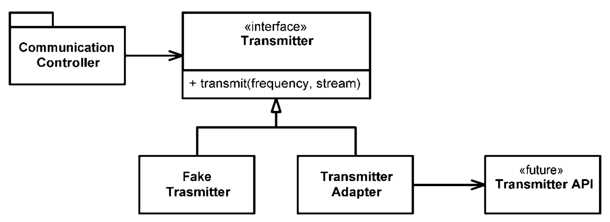

# Ranh giới
## bởi James Grenning

Chúng ta hiếm khi kiểm soát hoàn toàn các phần mềm trong hệ thống của mình. Đôi khi chúng ta mua gói của bên thứ ba hoặc sử dụng mã nguồn mở. Những lần khác, chúng ta phụ thuộc vào các nhóm trong công ty để sản xuất các thành phần hoặc hệ thống con. Bằng cách nào đó, chúng ta phải tích hợp các mã ngoài này với mã riêng của chúng ta một cách rõ ràng. Trong chương này, chúng ta sẽ xem xét các phương pháp và kỹ thuật để giữ cho ranh giới của phần mềm của chúng ta được sạch sẽ.

## Sử dụng mã của bên thứ ba
Có một vấn đề giữa nhà cung cấp **interface** và người sử dụng **interface** . Các nhà cung cấp các packages và frameworks bên thứ ba cố gắng mang lại khả năng ứng dụng rộng rãi để họ có thể hoạt động trong nhiều môi trường và thu hút nhiều đối tượng. Mặt khác, người dùng muốn có một **interface** tập trung vào các nhu cầu cụ thể của họ. Điều này có thể gây ra vấn đề ở ranh giới hệ thống của chúng ta.

Hãy xem **java.util.Map** làm ví dụ. Như bạn có thể thấy khi xem Hình 8-1, **map** có một **interface** rất lớn với nhiều chức năng. Chắc chắn sức mạnh và sự linh hoạt này là hữu ích, nhưng nó cũng có thể là một nguy hiểm tiềm ẩn. Ví dụ: ứng dụng của chúng tôi có thể xây dựng **map** và chuyển nó đi khắp nơi. Ý định của chúng tôi là không ai trong số những người nhận **map** xóa bất kỳ thứ gì trong **map**. Nhưng ngay ở đầu danh sách là phương thức **clear()**. Bất kỳ người nào sử dụng **map** cũng có quyền xóa nó. Hoặc có thể quy ước thiết kế của chúng tôi là chỉ các loại đối tượng cụ thể mới có thể được lưu trữ trong **map**, nhưng **map** không ràng buộc một cách đáng tin cậy các loại đối tượng được đặt trong chúng. Bất kỳ người dùng nào được xác định đều có thể thêm các mục thuộc bất kỳ loại nào vào bất kỳ **map** nào.
**Hình 8-1**
**Các phương pháp của map**
* clear() void – Map
* containsKey(Object key) boolean – Map
* containsValue(Object value) boolean – Map • entrySet() Set – Map
* equals(Object o) boolean – Map
* get(Object key) Object – Map
* getClass() Class<? extends Object> – Object • hashCode() int – Map
* isEmpty() boolean – Map
* keySet() Set – Map
* notify() void – Object
* notifyAll() void – Object
* put(Object key, Object value) Object – Map • putAll(Map t) void – Map
* remove(Object key) Object – Map
* size() int – Map
* toString() String – Object
* values() Collection – Map
* wait() void – Object
* wait(long timeout) void – Object
* wait(long timeout, int nanos) void – Object

Nếu ứng dụng của chúng ta cần **Map** of **Sensors**, bạn có thể tìm thấy các cảm biến được thiết lập như sau:
```java
  Map sensors = new HashMap();
```
Sau đó, khi một số phần khác của mã cần truy cập vào cảm biến, bạn sẽ thấy mã này:
```java
  Sensor s = (Sensor) sensors.get(sensorId );
```
Chúng tôi không chỉ nhìn thấy nó một lần mà nhiều lần xuyên suốt mã. Ứng dụng khách của mã này có trách nhiệm lấy một **Object** từ  **Map** và truyền nó đến đúng loại. Điều này hoạt động, nhưng nó không phải là mã sạch. Ngoài ra, mã này không kể câu chuyện của nó tốt như nó có thể. Khả năng đọc của mã này có thể được cải thiện đáng kể bằng cách sử dụng **generic**, như được hiển thị bên dưới:
```java
  Map<Sensor> sensors = new HashMap<Sensor>(); 
  ...
  Sensor s = sensors.get(sensorId );
```
Tuy nhiên, điều này không giải quyết được vấn đề mà **Map\<Sensor>** cung cấp nhiều khả năng hơn chúng ta cần hoặc muốn.

Thay đổi một cách tự do phiên bản của **Map\<Sensor>** xung quanh hệ thống có nghĩa là sẽ có rất nhiều chỗ cần sửa nếu **interface** của **Map** thay đổi. Bạn có thể nghĩ rằng một sự thay đổi như vậy là khó xảy ra, nhưng hãy nhớ rằng nó đã thay đổi khi hỗ trợ **generic** được thêm vào trong **Java 5**. Thật vậy, chúng tôi đã thấy các hệ thống bị hạn chế sử dụng **generics** vì mức độ lớn của những thay đổi cần thiết để bù đắp tự do sử dụng **map**s.

Cách tốt hơn để sử dụng **Map** có thể giống như sau. Không người sử dụng **Sensors** nào sẽ quan tâm đến việc liệu **generics** có được sử dụng hay không. Sự lựa chọn đó đã trở thành (và luôn luôn nên) một chi tiết thực hiện.
```java
public class Sensors {
  private Map sensors = new HashMap();
  public Sensor getById(String id) { 
    return (Sensor) sensors.get(id);
  }
  //snip 
}

```
Giao diện ở ranh giới (**Map**) bị ẩn. Nó có thể phát triển với rất ít tác động đến phần còn lại của ứng dụng. Việc sử dụng **generic** không còn là vấn đề lớn nữa vì quá trình truyền và quản lý kiểu được xử lý bên trong lớp **Sensors**.

Giao diện này cũng được điều chỉnh và hạn chế để đáp ứng nhu cầu của ứng dụng. Nó dẫn đến mã dễ hiểu hơn và khó bị lạm dụng hơn. Lớp **Sensors** có thể thực thi các quy tắc thiết kế và nghiệp vụ.

Chúng tôi không đề xuất rằng mọi việc sử dụng **Map** được gói gọn trong hình thức này. Thay vào đó, chúng tôi khuyên bạn không nên vượt qua **Map** (hoặc bất kỳ giao diện nào khác ở ranh giới) xung quanh hệ thống của bạn. Nếu bạn sử dụng interface ranh giới như **Map**, hãy giữ nó bên trong lớp hoặc đóng họ các lớp, nơi nó được sử dụng. Tránh trả về hoặc chấp nhận nó như một đối số cho các API công khai.

## Ranh giới Khám phá và Học hỏi
Mã của bên thứ ba giúp chúng ta nhận được nhiều chức năng đáp ứng yêu cầu trong thời gian ngắn. Chúng ta bắt đầu từ đâu khi muốn sử dụng một số gói của bên thứ ba? Công việc của chúng ta không phải là kiểm tra mã của bên thứ ba, nhưng chúng ta có thể suy nghĩ đến việc viết kiểm tra cho mã của bên thứ ba được chúng ta sử dụng.

Giả sử chúng ta không nắm rõ cách sử dụng thư viện bên thứ ba. Chúng ta có thể dành một ngày, hai ngày (hoặc hơn) để đọc tài liệu và quyết định cách sẽ sử dụng nó. Sau đó, có thể viết mã của mình để sử dụng mã của thư viện bên thứ ba và xem liệu nó có đúng như những gì chúng ta mong muốn hay không. Sẽ không ngạc nhiên khi thấy mình bị sa lầy trong các phiên gỡ lỗi, cố gắng tìm hiểu xem lỗi chúng ta đang gặp phải là trong mã của chúng ta hay của thư viện bên thứ ba được sử dụng.

Tìm hiểu mã của thử viện bên thứ ba rất khó. Tích hợp nó cũng khó khăn không kém, thực hiện cả hai cùng một lúc còn khó hơn rất nhiều. Điều gì sẽ xảy ra nếu chúng ta thực hiện một cách tiếp cận khác? Thay vì thử nghiệm và sai trong mã của mình, chúng ta có thể viết một số thử nghiệm để khám phá và tìm hiểu sâu hơn về mã của thư viện bên thứ ba. Jim Newkirk gọi những bài kiểm tra như vậy là **bài kiểm tra học tập**.

Trong các bài kiểm tra học tập, chúng ta gọi API của thư viện bên thứ ba, vì mong muốn sử dụng nó trong ứng dụng của mình. Về cơ bản, chúng ta đang thực hiện các thử nghiệm được kiểm soát để kiểm tra sự hiểu biết của về API đó. Các bài kiểm tra tập trung vào những gì chúng ta mong muốn từ API.

## Học về log4j
Giả sử chúng ta muốn sử dụng gói apache **log4j** hơn là trình ghi nhật ký được xây dựng tùy chỉnh riêng. Chúng ta tải xuống và mở trang tài liệu giới thiệu. Không cần đọc quá nhiều, chúng ta viết trường hợp thử nghiệm đầu tiên của mình, hy vọng nó sẽ viết “xin chào” vào bảng điều khiển.
```java
@Test
public void testLogCreate() {
    Logger logger = Logger.getLogger("MyLogger");
    logger.info("Xin chào"); 
}

```
Khi chạy nó, trình ghi nhật ký tạo ra một lỗi cho biết rằng cần một thứ gọi là **Appender**. Sau khi đọc thêm một chút, chúng ta thấy rằng có một **ConsoleAppender**. Vì vậy, chúng ta tạo một **ConsoleAppender** và xem liệu chúng ta đã biết cách hiển thị lên bảng điều khiển hay chưa.
```java
@Test
public void testLogAddAppender() {
    Logger logger = Logger.getLogger("MyLogger"); 
    ConsoleAppender appender = new ConsoleAppender();       
    logger.addAppender(appender); 
    logger.info("Xin chào");
}
```
Lần này, chúng a thấy rằng **Appender** không có luồng đầu ra. Quả là kỳ lạ? Sau khi nhờ trợ giúp từ Google, ta thử cách sau:
```java
@Test
public void testLogAddAppender() {
    Logger logger = Logger.getLogger("MyLogger"); 
    logger.removeAllAppenders(); 
    logger.addAppender(new ConsoleAppender(
        new PatternLayout("%p %t %m%n"),
        ConsoleAppender.SYSTEM_OUT)); 
    logger.info("Xin chào");
}
```
Điều đó đã hiệu quả; một thông báo nhật ký bao gồm “xin chào” xuất hiện trên bảng điều khiển! Có vẻ kỳ lạ khi chúng ta phải nói với **ConsoleAppender** rằng nó phải ghi vào bảng điều khiển.

Điều thú vị là khi chúng ta loại bỏ đối số **ConsoleAppender.SYSTEM_OUT**, chúng ta thấy rằng “xin chào” vẫn được in. Nhưng khi chúng ta loại bỏ **PatternLayout**, một lần nữa nó lại gặp phải việc thiếu một luồng đầu ra. Đây là việc rất kỳ lạ.

Xem xét kỹ hơn một chút vào tài liệu, chúng ta thấy rằng hàm tạo **ConsoleAppender** mặc định là "chưa được đặt thông số cấu hình", điều này có vẻ không rõ ràng hoặc hữu ích. Nó giống như một lỗi hoặc ít nhất là sự không nhất quán trong **log4j**.

Tìm kiếm trên google, đọc và thử nghiệm nhiều hơn, cuối cùng chúng tôi kết thúc với Listing 8-1. Chúng tôi đã khám phá ra rất nhiều điều về cách **log4j** hoạt động và chúng tôi đã mã hóa kiến thức đó thành một tập hợp các bài kiểm tra đơn vị đơn giản.

**Listing 8-1**
**LogTest.java**
```java
public class LogTest { 
  private Logger logger;
  
  @Before
  public void initialize() {
    logger = Logger.getLogger("logger"); 
    logger.removeAllAppenders(); 
    Logger.getRootLogger().removeAllAppenders();
  }
  
  @Test
  public void basicLogger() {
    BasicConfigurator.configure();
    logger.info("basicLogger"); 
  }
  
  @Test
  public void addAppenderWithStream() {
    logger.addAppender(new ConsoleAppender( 
      new PatternLayout("%p %t %m%n"), 
      ConsoleAppender.SYSTEM_OUT));
    logger.info("addAppenderWithStream"); 
  }
  
  @Test
  public void addAppenderWithoutStream() {
    logger.addAppender(new ConsoleAppender( 
      new PatternLayout("%p %t %m%n")));
    logger.info("addAppenderWithoutStream"); 
  }
}
```
Bây giờ chúng ta biết cách khởi tạo trình ghi bảng điều khiển đơn giản và chúng ta có thể đóng gói kiến thức đó vào lớp trình ghi nhật ký của riêng mình để phần còn lại của ứng dụng được tách biệt khỏi interface ranh giới **log4j**.
## Kiểm tra học tập tốt hơn là không làm gì cả
Các bài kiểm tra học tập kết thúc không tốn kém gì. Dù sao thì chúng ta cũng phải học API và viết những bài kiểm tra đó là một cách dễ dàng và riêng biệt để có được kiến thức đó. Các bài kiểm tra học tập là những thí nghiệm chính xác giúp tăng cường hiểu biết của chúng ta.

Không chỉ có giá trị ở thời điều hiện tại, kiểm tra học tập còn có lợi trong tương lai. Khi có các bản phát hành mới của gói thư viện bên thứ ba, chúng ta sẽ chạy các bài kiểm tra học tập để xem liệu có sự khác biệt về hành vi hay không.

Kiểm tra học tập xác minh rằng các gói của bên thứ ba đang hoạt động theo cách chúng ta mong muốn. Sau khi được tích hợp, không có gì đảm bảo rằng mã của bên thứ ba sẽ vẫn tương thích với nhu cầu của chúng ta. Các tác giả ban đầu sẽ có lý do để thay đổi mã của họ để đáp ứng những yêu cầu mới. Họ sẽ sửa lỗi và thêm các tính năng mới. Với mỗi lần phát hành đều tiềm ẩn những rủi ro. Nếu gói của bên thứ ba thay đổi theo một cách nào đó không tương thích với các thử nghiệm đã viết, chúng ta sẽ tìm hiểu ngay.

Cho dù bạn có cần kiến thức được cung cấp bởi các bài kiểm tra học tập hay không, một điều rõ ràng là bạn sẽ được hỗ trợ bởi một tập hợp các bài kiểm tra, thực hiện interface giống như cách mà mã của bạn sử dụng. Nếu không có các thử nghiệm này, có thể chúng ta sẽ bị cám dỗ ở lại với phiên bản cũ lâu hơn chúng ta nên làm.
## Sử dụng mã chưa tồn tại
Có một loại ranh giới khác, một loại ranh giới ngăn cách cái đã biết và cái chưa biết. Thường có những chỗ trong mã mà kiến thức của chúng ta dường như bị mất. Đôi khi những gì ở bên kia ranh giới là không thể biết được (ít nhất là ngay lúc này). Và lúc này chúng ta chọn không đi xa hơn ranh giới.

Một số năm trước, tôi là thành viên của nhóm phát triển phần mềm cho hệ thống thông tin liên lạc vô tuyến. Có một hệ thống con, “Transmitter,” mà chúng tôi ít biết về nó, và những người chịu trách nhiệm về hệ thống con chưa xác định interfce cho chúng. Chúng tôi không muốn phải dừng lại, vì vậy chúng tôi đã bắt đầu công việc của mình từ phần chưa biết của mã.

Chúng ta đã có một ý tưởng khá tốt khi vấn đề xẩy. Trong quá trình làm việc, đôi khi chúng ta tù mù không nắm rõ được vấn đề, nhưng rồi qua thời gian chúng ra đã nhận thức được chúng ta đích xác cần gì, chúng ta mong muốn điều gì trong quá trình phát triển để rồi dựng lên interface giao tiếp đáp ứng cho mong muốn của chúng ta. Một điều gì đó như thế này:  
>*Mã transmitter được cung cấp và phát ra một biểu diễn tương tự như dữ liệu đến từ luồng.*

Chúng tôi không biết điều đó sẽ được thực hiện như thế nào vì API chưa được thiết kế. Vì vậy, chúng tôi quyết định làm việc sau.

Để không phải dừng lại, chúng ta đã xác định interface của riêng mình. Chúng ta gọi nó là **Transmitter**. Chúng ta đã cung cấp cho nó một phương pháp gọi là **transmit** lấy tần số và luồng dữ liệu. Đây là interface mà chúng ta mong muốn có.

Một điều tốt khi viết giao diện mà chúng ta mong muốn là nó nằm trong tầm kiểm soát. Điều này giúp mã dễ đọc hơn và tập trung vào những gì nó đang cố gắng hoàn thành.

Trong Hình 8-2, bạn có thể thấy rằng chúng ta đã tách các lớp **CommunicationsController** khỏi transmitter API (nằm ngoài tầm kiểm soát của chúng ta và không được xác định). Bằng cách sử dụng interface ứng dụng cụ thể của riêng mình, chúng ta đã giữ cho mã **CommunicationsController** được sạch sẽ và dễ hiểu. Khi transmitter API được xác định, chúng ta đã viết **TransmitterAdapter** để thu hẹp khoảng cách. ADAPTOR đã đóng gói tương tác với API và cung cấp một nơi duy nhất để thay đổi khi API phát triển.  
**Figure 8-2**  
**Dự đoán transmitter**  

Thiết kế này cũng cung cấp một đường lối rất thuận tiện trong mã, để kiểm tra. Sử dụng **FakeTransmitter** hợp lý, chúng ta có thể kiểm tra các lớp **CommunicationsController**. Chúng ta cũng có thể tạo các bài kiểm tra ranh giới sau khi có **TransmitterAPI** để đảm bảo rằng chúng ta đang sử dụng API đúng cách.
## Ranh giới sạch
Nhiều điều thú vị xảy ra ở ranh giới. Thay đổi là một trong những điều đó. Các thiết kế phần mềm tốt có thể đáp ứng sự thay đổi mà không cần nhiều công sức hay đập đi làm lại. Khi sử dụng mã nằm ngoài tầm kiểm soát, chúng ta phải đặc biệt lưu ý để bảo vệ công sức của mình và đảm bảo việc thay đổi trong tương lai không quá tốn thời gian.

Mã ở ranh giới cần có sự phân tách rõ ràng và các bài kiểm tra xác định mong muốn của người thực hiện. Chúng ta nên tránh để quá nhiều mã của mình biết về các thông tin chi tiết của bên thứ ba. Tốt hơn là phụ thuộc vào thứ bạn biết rõ hơn là phụ thuộc vào thứ bạn chưa biết, vì nó sẽ chi phối bạn.

Chúng tôi quản lý ranh giới của bên thứ ba bằng cách có rất ít vị trí trong mã tham chiếu đến nó. Chúng tôi có thể bọc chúng như đã làm với **Map**, hoặc chúng tôi có thể sử dụng ADAPTER để chuyển đổi từ interface hoàn hảo của chúng tôi sang interface được cung cấp. Dù bằng cách nào thì mã của chúng tôi cũng được hiện tốt hơn, thúc đẩy việc sử dụng nhất quán nội bộ trên toàn bộ ranh giới và có ít thứ cần bảo trì hơn khi mã của bên thứ ba thay đổi.
## Thư mục
**[BeckTDD]**: Test Driven Development, Kent Beck, Addison-Wesley, 2003.  
**[GOF]**: Design Patterns: Elements of Reusable Object Oriented Software, Gamma et al., Addison-Wesley, 1996.  
**[WELC]**: Working Effectively with Legacy Code, Addison-Wesley, 2004.  


