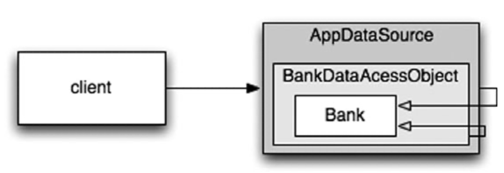

# Hệ thống
## bởi Tiến sĩ Kevin Dean Wampler

“Loại bỏ sự phức tạp. Nó bòn rút sự sống của các nhà phát triển, khiến các sản phẩm khó lên kế hoạch, xây dựng và thử nghiệm ”. —Ray Ozzie, CTO, Microsoft Corporation
## Bạn sẽ xây dựng một thành phố như thế nào?
Bạn có thể tự quản lý tất cả các chi tiết? Chắc là không. Ngay cả việc quản lý một thành phố hiện tại cũng là quá nhiều đối với một người. Tuy nhiên, các thành phố hoạt động (hầu hết thời gian). Chúng hoạt động vì các thành phố có các nhóm người quản lý các khu vực cụ thể của thành phố, hệ thống nước, hệ thống điện, giao thông, thực thi pháp luật, quy tắc xây dựng, v.v. Một số người chịu trách nhiệm về bức tranh toàn cảnh, trong khi những người khác tập trung vào các chi tiết.   

Các thành phố cũng hoạt động vì chúng đã phát triển các cấp độ **abstraction** và **mô đun** phù hợp để giúp các cá nhân và “bộ phận” mà họ quản lý làm việc hiệu quả, ngay cả khi không hiểu được bức tranh toàn cảnh.

Mặc dù các nhóm phần mềm cũng thường được tổ chức như vậy, nhưng các hệ thống mà họ làm việc thường không có sự tách biệt về mối quan tâm và mức độ **abstraction** giống nhau. Mã sạch sẽ giúp chúng tôi đạt được điều này ở mức độ **abstraction** thấp hơn. Trong chương này, chúng ta hãy xem xét cách duy trì sự sạch sẽ ở cấp độ **abstraction** cao hơn, cấp độ hệ thống.
## Tách biệt việc xây dựng một hệ thống với việc sử dụng nó
Đầu tiên, hãy xem xét rằng **xây dựng** là một quá trình rất khác với **sử dụng**. Khi tôi viết điều này, có một khách sạn mới đang được xây dựng mà tôi nhìn thấy qua cửa sổ của mình ở Chicago. Hiện tại nó là một khối bê tông với cần cẩu xây dựng và thang máy được bắt vít bên ngoài. Những người bận rộn ở đó đều đội mũ cứng và mặc quần áo lao động. Trong một năm hoặc lâu hơn, khách sạn sẽ được hoàn thành. Cần trục và thang máy sẽ không còn nữa. Tòa nhà sạch sẽ, được bao bọc trong các bức tường, cửa sổ bằng kính và sơn bắt mắt. Những người làm việc và ở đó trông cũng sẽ khác rất nhiều.

> Hệ thống phần mềm nên tách riêng quá trình khởi tạo, khi các đối tượng ứng dụng được xây dựng và các phần phụ thuộc được “kết nối” với nhau, khỏi runtime logic sau khi khởi tạo.

Quá trình khởi tạo là một **mối quan tâm** mà bất kỳ ứng dụng nào cũng phải giải quyết. Đó là **mối quan tâm** đầu tiên mà chúng ta sẽ xem xét trong chương này. **Tách các mối quan tâm** là một trong những kỹ thuật thiết kế lâu đời và quan trọng nhất trong nghề lập trình.

Thật không may, hầu hết các ứng dụng không tách biệt mối quan tâm này. Mã cho quá trình khởi tạo là đặc biệt và nó được trộn với runtime logic. Đây là một ví dụ điển hình:
```java
public Service getService() {
    if(service==null)
        service=new MyServiceImpl(...); // Good enough default for most cases?
        
    return service;
}
```
Đây là thành ngữ **LAZY INITIALIZATION/EVALUATION**, và nó có một số điểm đáng khen. Chúng ta không phải chịu chi phí xây dựng trừ khi chúng ta thực sự sử dụng đối tượng và do đó, thời gian khởi tạo có thể nhanh hơn. Chúng ta cũng đảm bảo rằng không bao giờ trả về **null**.

Tuy nhiên, bây giờ chúng ta có một sự phụ thuộc được hard-coded vào **MyServiceImpl** và mọi thứ mà hàm tạo của nó yêu cầu (mà tôi đã giải thích). Chúng ta không thể biên dịch mà không giải quyết các phần phụ thuộc này, ngay cả khi không bao giờ sử dụng một đối tượng nào khi chạy chương trình!

Kiểm tra có thể là một vấn đề. Nếu **MyServiceImpl** là một đối tượng nặng, cần đảm bảo rằng **TEST DOUBLE** hoặc **MOCK OBJECT** thích hợp được gán cho trường dịch vụ trước khi phương thức này được gọi trong quá trình kiểm tra đơn vị. Bởi vì, logic xây dựng trộn lẫn với xử lý runtime, chúng ta nên kiểm tra tất cả các đường dẫn thực thi (ví dụ: kiểm tra **null** và khối của nó). Có cả hai trách nhiệm này có nghĩa là phương pháp đang thực hiện nhiều hơn một việc, vì vậy chúng ta đang phá vỡ **Nguyên tắc Trách nhiệm Đơn lẻ** (SRP).

Có lẽ tệ nhất là chúng ta không biết liệu **MyServiceImpl** có phải là đối tượng phù hợp trong mọi trường hợp hay không. Tôi ngụ ý như trong **comment**. Tại sao lớp với phương thức này phải biết bối cảnh toàn cục? Có thể thực sự biết đối tượng phù hợp để sử dụng ở đây không? Liệu một loại có thể phù hợp với tất cả các ngữ cảnh có thể xảy ra không?

Tất nhiên, một lần xuất hiện LAZY-INITIALIZATION không phải là một vấn đề nghiêm trọng. Tuy nhiên, thông thường có **nhiều trường hợp** các thiết lập nhỏ như thế này xuất hiện trong ứng dụng. Do đó, việc thiết lập toàn cầu (nếu có) nằm rải rác trên ứng dụng, với ít mô đun và thường trùng lặp.

Nếu nghiêm túc về việc xây dựng các hệ thống tốt và mạnh mẽ, chúng ta không bao giờ nên để những cái lợi nhỏ dẫn đến việc phá vỡ mô-đun. Quá trình khởi tạo xây dựng đối tượng cũng không ngoại lệ. Nên mô-đun hóa quá trình này một cách riêng biệt với runtime logic thông thường và đảm bảo rằng có một chiến lược toàn cầu, nhất quán để giải quyết các phụ thuộc.
## Tách Main
Một cách để tách việc khởi tạo khỏi việc sử dụng, đơn giản là di chuyển toàn bộ việc khởi tạo sang **main**, hoặc các mô-đun được gọi bởi **main**, và thiết kế phần còn lại của hệ thống với giả định rằng tất cả các đối tượng đã được xây dựng và kết nối phù hợp (Xem Figure 11-1).   
**Figure 11-1**  
**Separating construction in main()**

Quy trình kiểm soát dễ dàng theo dõi. Hàm **main** xây dựng các đối tượng cần thiết cho hệ thống, sau đó chuyển chúng cho **application**, **application** chỉ việc sử dụng. Lưu ý hướng của các mũi tên phụ thuộc vượt qua rào cản giữa **main** và **application**. Tất cả đều đi về một hướng, hướng ra xa  **main**. Điều này có nghĩa là **application** không có kiến thức về  **main** hoặc về quá trình xây dựng. Nó chỉ đơn giản biết mọi thứ đã được xây dựng đúng cách.
## Factories
Tất nhiên, đôi khi chúng ta cần làm cho **application** chịu trách nhiệm về thời điểm một đối tượng được tạo. Ví dụ, trong một hệ thống xử lý đơn đặt hàng, **application** phải tạo các thể hiện **LineItem** để thêm vào **Order**. Trong trường hợp này, chúng ta có thể sử dụng mẫu ABSTRACT FACTORY để cung cấp cho **application** quyền kiểm soát thời điểm xây dựng các **LineItems**, nhưng giữ các chi tiết của cấu trúc đó tách biệt với mã **application** (Xem Figure 11-2).  
**Figure 11-2**    
**Separation construction with factory**  

Một lần nữa lưu ý rằng tất cả các phụ thuộc đều trỏ từ **main** đến ứng dụng **OrderProcessing**. Điều này có nghĩa là **application** được tách ra khỏi việc xây dựng **LineItem**. Khả năng đó được lưu giữ trong **LineItemFactoryImplementation**, nằm ở phía **main**. Tuy nhiên, **application**  hoàn toàn kiểm soát được thời điểm các instances **LineItem** được xây dựng và thậm chí có thể cung cấp các đối số hàm tạo dành riêng cho **application**.
## Dependency Injection
Một cơ chế mạnh mẽ để tách việc xây dựng khỏi việc sử dụng là **Dependency Injection** (DI), ứng dụng **Inversion of Control** (IoC) để quản lý sự phụ thuộc. Đảo ngược kiểm soát chuyển các trách nhiệm thứ cấp từ một đối tượng sang các đối tượng khác có mục đích chuyên biệt, do đó hỗ trợ **Nguyên tắc Trách nhiệm Đơn lẻ**. Trong bối cảnh quản lý phụ thuộc, một đối tượng không nên chịu trách nhiệm về việc khởi tạo các phụ thuộc. Thay vào đó, nó nên chuyển trách nhiệm này cho một cơ chế **“có thẩm quyền”** khác, do đó đảo ngược sự kiểm soát. Bởi vì thiết lập là mối quan tâm toàn cầu, cơ chế có thẩm quyền này thường sẽ là quy trình “main” hoặc một vùng chứa có mục đích đặc biệt.

Tra cứu JNDI là một triển khai **"partial"** của DI, trong đó một đối tượng yêu cầu một thư mục máy chủ cung cấp một **"service"** phù hợp với tên cụ thể.
```java
    MyService myService = (MyService) (jndiContext.lookup(“NameOfMyService”));
```
**Đối tượng gọi** không kiểm soát loại đối tượng nào được trả về (tất nhiên là miễn là nó triển khai interface thích hợp), nhưng **đối tượng gọi** vẫn tích cực giải quyết phụ thuộc.

True Dependency Injection tiến thêm một bước nữa. Hoàn toàn thụ động, lớp không trực tiếp giải quyết các phụ thuộc của nó. Thay vào đó, nó cung cấp các phương thức setter hoặc các đối số cho phương thức khởi tạo (hoặc cả hai) để chèn các phần phụ thuộc. Trong quá trình xây dựng, vùng chứa DI khởi tạo các đối tượng được yêu cầu (thường là theo yêu cầu) và sử dụng các đối số của phương thức khởi tạo hoặc phương thức setter được cung cấp để kết nối các phụ thuộc với nhau. Đối tượng phụ thuộc nào được sử dụng thực sự được chỉ định thông qua tệp cấu hình hoặc được lập trình trong mô-đun xây dựng đặc biệt.

Spring Framework cung cấp vùng chứa DI nổi tiếng nhất cho Java. Bạn xác định các đối tượng nào để kết nối với nhau trong tệp cấu hình XML, sau đó bạn yêu cầu các đối tượng cụ thể theo tên trong mã Java. Chúng ta sẽ xem xét một ví dụ ngay sau đây.

Nhưng còn LAZY-INITIALIZATION? Đôi khi nó vẫn hữu ích với DI. Đầu tiên, hầu hết các vùng chứa DI sẽ không tạo một đối tượng cho đến khi cần thiết. Thứ hai, nhiều vùng chứa này cung cấp các cơ chế để gọi factories hoặc để xây dựng proxy, có thể được sử dụng để LAZY-EVALUATION và tối ưu hóa.
## Mở rộng quy mô
Các thành phố phát triển từ các thị trấn & khu định cư. Lúc đầu, những con đường nhỏ hẹp và không tồn tại, sau đó chúng được trải nhựa, rồi được mở rộng theo thời gian. Các tòa nhà nhỏ và các mảnh đất trống được lấp đầy bởi các tòa nhà lớn, một số trong số đó cuối cùng sẽ được thay thế với những tòa nhà chọc trời.

Lúc đầu, không có các dịch vụ như điện, nước, thoát nước và Internet. Các dịch vụ này dần được bổ sung khi dân số và mật độ xây dựng tăng lên.

Sự phát triển này không phải là không **có sai lầm**. Đã bao nhiêu lần bạn lái xe, vượt qua một dự án “cải thiện” đường và tự hỏi mình, “Tại sao họ không xây dựng nó đủ rộng ngay từ đầu!?”

Nhưng nó không thể xảy ra theo bất kỳ cách nào. Ai có thể biện minh cho chi phí của một đường cao tốc sáu làn xuyên qua giữa một thị trấn nhỏ? Ai sẽ muốn một con đường như vậy qua thị trấn của họ?

Thật là hoang đường khi chúng ta có được hệ thống hoàn chỉnh “ngay lần đầu tiên”. Thay vào đó, chúng ta chỉ nên đề cập đến những vấn đề của ngày hôm nay, sau đó tái cấu trúc và mở rộng hệ thống để triển khai những vấn đề mới vào ngày mai. Đây là bản chất của sự lặp đi lặp lại và phát triển. Quá trình phát triển theo hướng thử nghiệm, tái cấu trúc và mã sạch mà họ tạo ra làm cho việc này hoạt động ở cấp mã.

Nhưng ở cấp độ hệ thống thì sao? Cấu trúc hệ thống không yêu cầu lập kế hoạch trước phải không? Chắc chắn, nó không thể tăng dần từ đơn giản đến phức tạp, phải không?
> Hệ thống phần mềm là duy nhất so với hệ thống vật lý. Các kiến trúc của chúng có thể phát triển từng bước, **nếu** chúng ta duy trì sự phân tách các mối quan tâm một cách thích hợp.

Bản chất thay đổi liên tục của các hệ thống phần mềm làm cho điều này trở nên khả thi, như chúng ta sẽ thấy. Trước tiên, hãy xem xét một ví dụ về một kiến trúc **không phân tách** các mối quan tâm một cách thỏa đáng.

Các kiến trúc EJB1 và EJB2 ban đầu đã không tách biệt các mối quan tâm một cách thích hợp và do đó áp đặt các rào cản không cần thiết. Hãy xem xét một thực thể **Bean** cho một lớp **Bank**. Một thực thể **bean** là một biểu diễn trong bộ nhớ của dữ liệu quan hệ, hay nói cách khác, là một hàng của bảng.

Đầu tiên, bạn phải xác định giao diện cục bộ (đang trong quá trình xử lý) hoặc giao diện từ xa (JVM riêng biệt), mà các ứng dụng khách sẽ sử dụng. Listing 11-1 cho thấy một giao diện cục bộ có thể có:   
**Listing 11-1**  
**An EJB2 local interface for a Bank EJB**
```java
package com.example.banking;

import java.util.Collections;
import javax.ejb.*;

public interface BankLocal extends java.ejb.EJBLocalObject {
    String getStreetAddr1() throws EJBException;

    String getStreetAddr2() throws EJBException;

    String getCity() throws EJBException;

    String getState() throws EJBException;

    String getZipCode() throws EJBException;

    void setStreetAddr1(String street1) throws EJBException;

    void setStreetAddr2(String street2) throws EJBException;

    void setCity(String city) throws EJBException;

    void setState(String state) throws EJBException;

    void setZipCode(String zip) throws EJBException;

    Collection getAccounts() throws EJBException;

    void setAccounts(Collection accounts) throws EJBException;

    void addAccount(AccountDTO accountDTO) throws EJBException;
}
```
Tôi đã hiển thị một số thuộc tính cho địa chỉ **Bank**’s và tập hợp các tài khoản mà ngân hàng sở hữu, mỗi thuộc tính sẽ được xử lý dữ liệu bởi một **Account** EJB riêng biệt. Listing 11-2 cho thấy lớp triển khai tương ứng cho **Bank**.   
**Listing 11-2**   
**The corresponding EJB2 Entity Bean Implementation**  
```java
package com.example.banking;

import java.util.Collections;
import javax.ejb.*;

public abstract class Bank implements javax.ejb.EntityBean {
    // Business logic...
    public abstract String getStreetAddr1();

    public abstract String getStreetAddr2();

    public abstract String getCity();

    public abstract String getState();

    public abstract String getZipCode();

    public abstract void setStreetAddr1(String street1);

    public abstract void setStreetAddr2(String street1);

    public abstract void setCity(String city);

    public abstract void setState(String state);

    public abstract void setZipCode(String zip);

    public abstract Collection getAccounts();

    public abstract void setAccounts(Collection accounts);

    public void addAccount(AccountDTO accountDTO) {
        InitialContext context = new InitialContext();
        AccountHomeLocal accountHome = context.lookup("AccountHomeLocal");
        AccountLocal account = accountHome.create(accountDTO);
        Collection accounts = getAccounts();
        accounts.add(account);
    }

    // EJB container logic
    public abstract void setId(Integer id);

    public abstract Integer getId();

    public Integer ejbCreate(Integer id) { ...}

    public void ejbPostCreate(Integer id) { ...}

    // The rest had to be implemented but were usually empty:
    public void setEntityContext(EntityContext ctx) {
    }

    public void unsetEntityContext() {
    }

    public void ejbActivate() {
    }

    public void ejbPassivate() {
    }

    public void ejbLoad() {
    }

    public void ejbStore() {
    }

    public void ejbRemove() {
    }
}
```
Tôi chưa hiển thị interface **LocalHome** tương ứng, về cơ bản là một factory được sử dụng để tạo các đối tượng, cũng như không có bất kỳ phương pháp tìm **Bank** (truy vấn) nào mà bạn có thể thêm vào.

Cuối cùng, bạn phải viết một hoặc nhiều bộ mô tả triển khai XML chỉ định chi tiết ánh xạ quan hệ đối tượng đến một kho lưu trữ liên tục, hành vi giao dịch mong muốn, các ràng buộc bảo mật, v.v.

Logic nghiệp vụ được kết hợp chặt chẽ với “container” ứng dụng EJB2. Bạn phải phân lớp các loại container và bạn phải cung cấp nhiều phương thức vòng đời mà container yêu cầu.

Do khớp nối này với thùng chứa nặng, việc kiểm tra đơn vị biệt lập rất khó khăn. Cần phải mô phỏng vùng chứa, điều này khó hoặc tốn nhiều thời gian triển khai các EJB và thử nghiệm cho một máy chủ thực. Việc sử dụng lại kiến trúc EJB2 bên ngoài có thể là một cách hiệu quả, do khớp nối chặt chẽ.

Cuối cùng, ngay cả lập trình hướng đối tượng cũng bị phá hủy. Một bean không thể kế thừa từ một bean khác. Lưu ý logic để thêm tài khoản mới. Thông thường trong các bean EJB2 là định nghĩa “các đối tượng truyền dữ liệu” (DTO) về cơ bản là “cấu trúc” không có hành vi. Điều này thường dẫn đến các kiểu dư thừa về cơ bản cùng giữ một dữ liệu và nó yêu cầu mã soạn sẵn để sao chép dữ liệu từ đối tượng này sang đối tượng khác.
## Mối quan tâm xuyên suốt
Kiến trúc EJB2 tiến gần đến sự tách biệt thực sự của các mối quan tâm trong một số lĩnh vực. Ví dụ: giao dịch mong muốn, bảo mật và một số hành vi liên tục được khai báo trong bộ mô tả triển khai, độc lập với mã nguồn.

Lưu ý rằng những mối quan tâm có xu hướng vượt qua ranh giới của đối tượng tự nhiên của **domain**. Bạn muốn duy trì tất cả các đối tượng của mình nói chung bằng cùng một cách, ví dụ: sử dụng một DBMS cụ thể so với một tệp phẳng, tuân theo các quy ước đặt tên nhất định cho các bảng và cột, sử dụng ý nghĩa giao dịch nhất quán của ngôn ngữ, v.v.

Về nguyên tắc, bạn có thể lập luận chiến lược **persistence** của mình theo mô-đun. Tuy nhiên, trong thực tế, về cơ bản bạn phải viết cùng một đoạn mã thực hiện chiến lược trên nhiều đối tượng. Chúng tôi sử dụng thuật ngữ mối quan hệ xuyên suốt cho những trường hợp như thế này. Một lần nữa, **persistence framework** có thể là mô-đun và domain logic của chúng tôi. Vấn đề là sự giao nhau giữa các domain này.

Trên thực tế, cách kiến trúc EJB xử lý tính **persistence**, bảo mật và giao dịch, lập trình hướng khía cạnh “được dự đoán trước” (AOP), là một cách tiếp cận có mục đích nhằm khôi phục mô-đun cho các mối quan hệ xuyên suốt.

Trong AOP, các cấu trúc mô-đun được gọi là các khía cạnh chỉ định điểm nào trong hệ thống cần được sửa đổi hành vi của chúng theo một cách nhất quán nào đó nhằm hỗ trợ một mối quan hệ cụ thể. Đặc tả này được thực hiện bằng cách sử dụng cơ chế khai báo hoặc lập trình rút gọn.

Sử dụng persistence làm ví dụ, bạn sẽ khai báo các đối tượng và thuộc tính (hoặc các mẫu của chúng) nên được duy trì và sau đó ủy quyền các nhiệm vụ persistence cho khung persistence của bạn. Các sửa đổi hành vi được thực hiện không xâm phạm đến mã đích bởi khung AOP. Chúng ta hãy xem xét ba khía cạnh hoặc các cơ chế giống như khía cạnh trong Java.
## Java Proxies
Các proxy Java phù hợp với các tình huống đơn giản, chẳng hạn như chứa các cuộc gọi phương thức trong các đối tượng hoặc lớp riêng lẻ. Tuy nhiên, các proxy động được cung cấp trong JDK chỉ hoạt động với **interfaces**. Đối với các lớp proxy, bạn phải sử dụng thư viện thao tác byte-code, chẳng hạn như CGLIB, ASM hoặc Javassist.  

Listing 11-3 hiển thị khung cho proxy JDK để cung cấp hỗ trợ lâu dài cho ứng dụng Bank, chỉ bao gồm các phương pháp getting và setting danh sách tài khoản.  
**Listing 11-3**  ****
**JDK Proxy Example**
```java
// Bank.java (suppressing package names...)
import java.utils.*;

// The abstraction of a bank.
public interface Bank {
    Collection<Account> getAccounts();

    void setAccounts(Collection<Account> accounts);
}

// BankImpl.java
import java.utils.*;

// The “Plain Old Java Object” (POJO) implementing the abstraction.
public class BankImpl implements Bank {
    private List<Account> accounts;

    public Collection<Account> getAccounts() {
        return accounts;
    }

    public void setAccounts(Collection<Account> accounts) {
        this.accounts = new ArrayList<Account>();
        for (Account account : accounts) {
            this.accounts.add(account);
        }
    }
}

// BankProxyHandler.java
import java.lang.reflect.*;
import java.util.*;

// “InvocationHandler” required by the proxy API.
public class BankProxyHandler implements InvocationHandler {
    private Bank bank;

    public BankHandler(Bank bank) {
        this.bank = bank;
    }

    // Method defined in InvocationHandler
    public Object invoke(Object proxy, Method method, Object[] args)
            throws Throwable {
        String methodName = method.getName();
        if (methodName.equals("getAccounts")) {
            bank.setAccounts(getAccountsFromDatabase());
            return bank.getAccounts();
        } else if (methodName.equals("setAccounts")) {
            bank.setAccounts((Collection<Account>) args[0]);
            setAccountsToDatabase(bank.getAccounts());
            return
        } else {
            // ...
        }
    }

    // Lots of details here:
    protected Collection<Account> getAccountsFromDatabase() {
        // ...
    }

    protected void setAccountsToDatabase(Collection<Account> accounts) {
        // ...
    }
}

// Somewhere else...
Bank bank = (Bank) Proxy.newProxyInstance( 
        Bank.class.getClassLoader(),
        new Class[] { Bank.class },
        new BankProxyHandler(new BankImpl())
);
```
Chúng tôi đã xác định một interface **Bank**, sẽ được bao bọc bởi proxy và *Đối tượng Java thuần (POJO)*, **BankImpl**, thực hiện logic nghiệp vụ. (Chúng tôi sẽ sớm truy cập lại POJO).

API Proxy yêu cầu một đối tượng **InvocationHandler** mà nó gọi để triển khai bất kỳ lệnh gọi phương thức Bank nào được thực hiện cho proxy. **BankProxyHandler** của chúng tôi sử dụng API phản chiếu Java để ánh xạ các lệnh gọi phương thức chung với các phương thức tương ứng trong **BankImpl**, v.v.

Có rất nhiều mã ở đây và nó tương đối phức tạp, ngay cả đối với trường hợp đơn giản này. Việc sử dụng một trong các thư viện byte-manipulation cũng tương tự như vậy. “Khối lượng” và độ phức tạp của mã này là hai trong số những hạn chế của proxy. Khó tạo ra mã sạch! Ngoài ra, proxy không cung cấp cơ chế chỉ định "điểm" thực thi trên toàn hệ thống, cần thiết cho một giải pháp AOP thực sự.
## Khung AOP thuần Java
May mắn thay, hầu hết các proxy boilerplate có thể được xử lý tự động bằng các công cụ. Proxy được sử dụng nội bộ trong một số khuôn khổ Java, ví dụ: Spring AOP và JBoss AOP, để triển khai các khía cạnh trong Java thuần túy. Trong Spring, bạn viết logic nghiệp vụ của mình dưới dạng **Đối tượng Java thuần**. POJO hoàn toàn tập trung vào miền của họ. Chúng không phụ thuộc vào các khuôn khổ doanh nghiệp (hoặc bất kỳ miền nào khác). Do đó, chúng đơn giản hơn về mặt khái niệm và kiểm tra hơn. Tính đơn giản tương đối giúp bạn dễ dàng hơn trong việc triển khai các yêu cầu người dùng tương ứng một cách chính xác và duy trì và phát triển mã cho các  cầu trong tương lai.

Bạn kết hợp cơ sở hạ tầng ứng dụng bắt buộc, bao gồm các mối quan tâm xuyên suốt như tính bền bỉ, giao dịch, bảo mật, bộ nhớ đệm, chuyển đổi dự phòng, v.v. bằng cách sử dụng các tệp cấu hình khai báo hoặc API. Trong nhiều trường hợp, bạn đang thực sự chỉ định các khía cạnh thư viện Spring hoặc JBoss, nơi khung công tác xử lý cơ chế sử dụng proxy Java hoặc thư viện byte-code một cách minh bạch cho người dùng. Các khai báo này thúc đẩy vùng chứa phụ thuộc (DI), khởi tạo các đối tượng chính và kết nối chúng lại với nhau theo yêu cầu.

Listing 11-4 hiển thị một đoạn điển hình của tệp cấu hình Spring V2.5, app.xml    
**Listing 11-4**   
**Spring 2.X configuration file**
```xml
<beans>
    ...
    <bean id="appDataSource"
          class="org.apache.commons.dbcp.BasicDataSource"
          destroy-method="close"
          p:driverClassName="com.mysql.jdbc.Driver"
          p:url="jdbc:mysql://localhost:3306/mydb"
          p:username="me"/>

    <bean id="bankDataAccessObject"
          class="com.example.banking.persistence.BankDataAccessObject"
          p:dataSource-ref="appDataSource"/>

    <bean id="bank"
          class="com.example.banking.model.Bank"
          p:dataAccessObject-ref="bankDataAccessObject"/>
    ...
</beans>
```
Mỗi “bean” giống như một phần của “Russian doll” lồng vào nhau, với một đối tượng miền cho **Bank** được ủy quyền (bọc) bởi một đối tượng truy cập dữ liệu (DAO), chính nó được cấp phép bởi nguồn dữ liệu trình điều khiển JDBC. (See Figure 11-3).  
**Figure 11-3**  
**The “Russian doll” of decorators**


Khách hàng tin rằng nó đang gọi **getAccounts()** trên một đối tượng **Bank**, nhưng nó thực sự đang nói chuyện với phần ngoài cùng của một tập hợp các đối tượng DECORATOR lồng nhau để mở rộng hành vi cơ bản của **Bank** POJO. Chúng tôi có thể thêm các trình trang trí khác cho các giao dịch, bộ nhớ đệm, v.v.

Trong ứng dụng, cần có một vài dòng để hỏi vùng chứa DI cho các đối tượng cấp cao nhất trong hệ thống, như được chỉ định trong tệp XML.
```java
    XmlBeanFactory bf = new XmlBeanFactory(new ClassPathResource("app.xml", getClass()));
    Bank bank = (Bank) bf.getBean("bank");
```
Bởi vì yêu cầu quá ít dòng mã Java dành riêng cho Spring, ứng dụng gần như được tách hoàn toàn khỏi Spring, loại bỏ tất cả các vấn đề liên kết chặt chẽ của các hệ thống như EJB2.

Mặc dù XML có thể dài dòng và khó đọc, “policy” được chỉ định trong các tệp hình dung này đơn giản hơn so với proxy và logic phức tạp được ẩn khỏi chế độ xem và được tạo tự động. Kiểu kiến trúc này hấp dẫn đến mức khung hoạt động giống như Spring dẫn đến việc đại tu hoàn toàn tiêu chuẩn EJB cho phiên bản 3. EJB3 phần lớn tuân theo mô hình Spring hỗ trợ khai báo các mối quan tâm xuyên suốt bằng cách sử dụng tệp cấu hình XML và/hoặc chú thích Java 5.

Listing 11-5 cho thấy đối tượng **Bank** của chúng tôi được viết lại bằng EJB3   
**Listing 11-5**  
**An EBJ3 Bank EJB**  
```java
package com.example.banking.model;

import javax.persistence.*;
import java.util.ArrayList;
import java.util.Collection;

@Entity
@Table(name = "BANKS")
public class Bank implements java.io.Serializable {
    @Id
    @GeneratedValue(strategy = GenerationType.AUTO)
    private int id;

    @Embeddable // An object “inlined” in Bank’s DB row
    public class Address {
        protected String streetAddr1;
        protected String streetAddr2;
        protected String city;
        protected String state;
        protected String zipCode;
    }

    @Embedded
    private Address address;
    @OneToMany(cascade = CascadeType.ALL, fetch = FetchType.EAGER, mappedBy = "bank")
    private Collection<Account> accounts = new ArrayList<Account>();

    public int getId() {
        return id;
    }

    public void setId(int id) {
        this.id = id;
    }

    public void addAccount(Account account) {
        account.setBank(this);
        accounts.add(account);
    }

    public Collection<Account> getAccounts() {
        return accounts;
    }

    public void setAccounts(Collection<Account> accounts) {
        this.accounts = accounts;
    }
}
```
Mã này sạch hơn nhiều so với mã EJB2 gốc. Một số chi tiết về thực thể vẫn còn ở đây, có trong các chú thích. Tuy nhiên, vì không có thông tin nào nằm ngoài các chú thích, nên mã sạch, rõ ràng và do đó dễ dàng để kiểm thử, bảo trì, v.v.

Một số hoặc tất cả thông tin liên tục trong các chú thích có thể được chuyển đến các bộ mô tả triển khai XML, nếu muốn, để lại một POJO thực sự thuần túy. Nếu các chi tiết ánh xạ liên tục không thay đổi thường xuyên, nhiều nhóm có thể chọn giữ lại các chú thích, nhưng ít có nhược điểm có hại hơn nhiều so với tính xâm lấn của EJB2.
## AspectJ Aspects
Cuối cùng, công cụ đầy đủ tính năng nhất để phân tách mối quan tâm qua các khía cạnh là ngôn ngữ AspectJ, một phần mở rộng của Java cung cấp hỗ trợ “hạng nhất” cho các khía cạnh dưới dạng cấu trúc mô-đun. Các phương pháp tiếp cận Java thuần túy do Spring AOP và JBoss AOP cung cấp là đủ cho 80–90% các trường hợp mà các khía cạnh hữu ích nhất. Tuy nhiên, AspectJ cung cấp một bộ công cụ rất phong phú và mạnh mẽ để phân tách các mối quan tâm. Hạn chế của AspectJ là cần phải sử dụng một số công cụ mới và học các cấu trúc ngôn ngữ mới và cách sử dụng thành ngữ.

Các vấn đề về áp dụng đã được giảm thiểu một phần nhờ một “dạng chú thích” được giới thiệu gần đây của AspectJ, nơi các chú thích của Java 5 được sử dụng để xác định các khía cạnh bằng cách sử dụng mã Java thuần túy. Ngoài ra, Spring Framework có một số tính năng giúp việc kết hợp các khía cạnh dựa trên chú thích trở nên dễ dàng hơn nhiều cho một nhóm có kinh nghiệm AspectJ hạn chế.

Một cuộc thảo luận đầy đủ về AspectJ nằm ngoài phạm vi của cuốn sách này. Xem [AspectJ], [Colyer] và [Spring] để biết thêm thông tin.
##  Kiểm thử kiến trúc hệ thống
Không thể phóng đại sức mạnh của việc phân tách mối quan tâm thông qua các phương pháp tiếp cận theo khía cạnh. Nếu bạn có thể viết logic miền của ứng dụng bằng POJO, được tách biệt khỏi bất kỳ mối quan tâm nào về kiến trúc ở cấp mã, thì bạn có thể thực sự kiểm tra kiến trúc của mình. Bạn có thể phát triển nó từ đơn giản đến phức tạp, nếu cần, bằng cách áp dụng các công nghệ mới theo yêu cầu. Không cần thiết phải thực hiện Big Design Up Front (BDUF). Trên thực tế, BDUF thậm chí còn có hại vì nó ức chế khả năng thích ứng với sự thay đổi, do tâm lý chống đối việc bỏ qua nỗ lực trước đó và do cách lựa chọn kiến trúc ảnh hưởng đến suy nghĩ sau này về thiết kế.

Các kiến trúc sư xây dựng phải thực hiện BDUF vì việc thay đổi kiến trúc triệt để đối với một cấu trúc vật lý lớn là không khả thi khi quá trình xây dựng đang diễn ra tốt đẹp. Mặc dù phần mềm có vật lý riêng của nó, nhưng sẽ khả thi về mặt kinh tế để thực hiện thay đổi triệt để, nếu cấu trúc của phần mềm phân tách các mối quan tâm của nó một cách hiệu quả.

Điều này có nghĩa là chúng tôi có thể bắt đầu một dự án phần mềm với kiến trúc “đơn giản vô cùng” nhưng được phân tách độc đáo, cung cấp các câu chuyện người dùng đang hoạt động một cách nhanh chóng, sau đó bổ sung thêm cơ sở hạ tầng khi chúng tôi mở rộng quy mô. Một số trang Web lớn nhất thế giới đã đạt được tính khả dụng và hiệu suất rất cao, sử dụng bộ nhớ đệm dữ liệu phức tạp, bảo mật, ảo hóa, v.v., tất cả đều được thực hiện một cách hiệu quả và linh hoạt vì các thiết kế kết hợp tối thiểu rất đơn giản ở từng cấp độ trừu tượng và phạm vi.

Tất nhiên, điều này không có nghĩa là chúng ta đi vào một dự án “không có bánh lái”. Chúng tôi có một số kỳ vọng về phạm vi, mục tiêu và lịch trình chung cho dự án, cũng như cấu trúc chung của hệ thống kết quả. Tuy nhiên, chúng ta phải duy trì khả năng thay đổi hướng đi để đáp ứng với các hoàn cảnh đang phát triển.

Kiến trúc EJB ban đầu nhưng là một trong nhiều API nổi tiếng được thiết kế kỹ lưỡng và điều đó làm ảnh hưởng đến sự phân tách các mối quan tâm. Ngay cả những API được thiết kế tốt cũng có thể quá mức cần thiết khi chúng không thực sự cần thiết. Một API tốt phần lớn sẽ biến mất khỏi chế độ xem, vì vậy nhóm dành phần lớn nỗ lực sáng tạo tập trung vào các câu chuyện người dùng đang được triển khai. Nếu không, thì những ràng buộc về kiến trúc sẽ cản trở việc cung cấp hiệu quả giá trị tối ưu cho khách hàng.

Để tóm tắt lại cuộc thảo luận dài này,
> Một kiến trúc hệ thống tối ưu bao gồm các miền cần quan tâm được mô-đun hóa, mỗi miền được thực hiện với các Plain Old Java (hoặc các đối tượng khác). Các miền khác nhau được tích hợp với nhau bằng các công cụ Aspects hoặc Aspect xâm lấn tối thiểu. Kiến trúc này có thể được kiểm tra theo hướng, giống như mã.
## Tối ưu hóa việc ra quyết định
Tính mô-đun hóa và tách biệt các mối quan tâm giúp khả năng quản lý và ra quyết định phi tập trung. Trong một hệ thống đủ lớn, cho dù đó là một thành phố hay một dự án phần mềm, không ai có thể đưa ra tất cả các quyết định.

Tất cả chúng ta đều biết tốt nhất nên giao trách nhiệm cho những người có năng lực nhất. Chúng ta thường quên rằng tốt nhất là nên trì hoãn các quyết định cho đến thời điểm cuối cùng có thể. Đây không phải là lười biếng hay vô trách nhiệm; nó cho phép chúng tôi đưa ra những lựa chọn sáng suốt với thông tin tốt nhất có thể. Một quyết định sớm là một quyết định được đưa ra với kiến thức chưa tối ưu. Chúng tôi sẽ nhận được ít phản hồi của khách hàng hơn, những suy ngẫm về dự án và trải nghiệm với các lựa chọn triển khai của chúng tôi nếu chúng tôi quyết định quá sớm.
> Sự nhanh nhạy được cung cấp bởi hệ thống POJO với các mối quan tâm được mô-đun hóa cho phép chúng tôi đưa ra quyết định tối ưu, đúng lúc, dựa trên kiến thức gần đây nhất. Sự phức tạp của các quyết định này cũng được giảm bớt.
## Sử dụng các tiêu chuẩn một cách khôn ngoan, khi chúng thêm giá trị có thể chứng minh
Việc xây dựng tòa nhà là một điều kỳ diệu để xem vì tốc độ xây dựng các tòa nhà mới (ngay cả trong mùa đông chết chóc) và vì những thiết kế đặc biệt phù hợp với công nghệ ngày nay. Xây dựng là một ngành công nghiệp trưởng thành với các bộ phận, phương pháp và tiêu chuẩn được tối ưu hóa cao, đã phát triển dưới áp lực trong nhiều thế kỷ.

Nhiều nhóm đã sử dụng kiến trúc EJB2 vì nó là một tiêu chuẩn, ngay cả khi thiết kế nhẹ hơn và đơn giản hơn là đủ. Tôi đã thấy các teams bị ám ảnh bởi nhiều tiêu chuẩn được thổi phồng mạnh mẽ và mất tập trung vào việc triển khai giá trị cho khách hàng của họ.
> Các tiêu chuẩn giúp việc sử dụng lại các ý tưởng và thành phần trở nên dễ dàng hơn, tuyển dụng những người có kinh nghiệm phù hợp, gói gọn các ý tưởng hay và kết nối các thành phần lại với nhau. Tuy nhiên, quá trình tạo ra các tiêu chuẩn đôi khi có thể mất quá nhiều thời gian để ngành công nghiệp phải chờ đợi và một số tiêu chuẩn không phù hợp với nhu cầu thực sự của những người chấp nhận mà chúng dự kiến phục vụ.
## Hệ thống cần ngôn ngữ dành riêng cho miền
Xây dựng tòa nhà, giống như hầu hết các lĩnh vực, đã phát triển một ngôn ngữ phong phú với vốn từ vựng, thành ngữ và mẫu truyền tải thông tin cần thiết một cách rõ ràng và ngắn gọn. Trong phần mềm, gần đây đã có sự quan tâm trở lại đến việc tạo ra các Ngôn ngữ dành riêng cho miền (DSL), là các ngôn ngữ kịch bản nhỏ, riêng biệt hoặc API trong các ngôn ngữ tiêu chuẩn cho phép viết mã để nó đọc giống như một dạng văn xuôi có cấu trúc mà một chuyên gia domain có thể viết.

DSL tốt sẽ giảm thiểu “khoảng cách giao tiếp” giữa khái niệm miền và mã triển khai nó, giống như các phương pháp linh hoạt tối ưu hóa thông tin liên lạc trong nhóm và với các bên liên quan của dự án. Nếu bạn đang triển khai logic miền bằng cùng một ngôn ngữ mà chuyên gia miền sử dụng, sẽ có ít rủi ro hơn là bạn sẽ dịch sai miền sang triển khai.

DSL, khi được sử dụng hiệu quả, sẽ nâng cao mức độ trừu tượng lên trên các thành ngữ mã và các mẫu thiết kế. Chúng cho phép nhà phát triển tiết lộ mục đích của mã ở mức độ trừu tượng thích hợp.
> Ngôn ngữ dành riêng cho miền cho phép tất cả các cấp độ trừu tượng và tất cả các miền trong ứng dụng được thể hiện dưới dạng POJO, từ chính sách cấp cao đến chi tiết cấp thấp.
## Phần kết luận
Hệ thống cũng phải sạch. Một kiến trúc xâm lấn lấn át logic miền và ảnh hưởng đến sự nhanh nhẹn. Khi logic miền bị che khuất, chất lượng sẽ bị ảnh hưởng vì lỗi dễ ẩn hơn và các câu chuyện trở nên khó thực hiện hơn. Nếu sự nhanh nhẹn bị ảnh hưởng, năng suất bị ảnh hưởng và lợi ích của TDD bị mất.

Ở tất cả các cấp độ trừu tượng, ý định phải rõ ràng. Điều này sẽ chỉ xảy ra nếu bạn viết POJO và bạn sử dụng các cơ chế giống khía cạnh để kết hợp các mối quan tâm triển khai khác một cách không xâm phạm.

Cho dù bạn đang thiết kế hệ thống hay mô-đun riêng lẻ, đừng bao giờ quên **sử dụng thứ đơn giản nhất có thể hoạt động**.
## Tham khảo
**[Alexander]**: Christopher Alexander, A Timeless Way of Building, Oxford University Press, New York, 1979.
**[AOSD]**: Aspect-Oriented Software Development port, http://aosd.net
**[ASM]**: ASM Home Page, http://asm.objectweb.org/
**[AspectJ]**: http://eclipse.org/aspectj
**[CGLIB]**: Code Generation Library, http://cglib.sourceforge.net/
**[Colyer]**: Adrian Colyer, Andy Clement, George Hurley, Mathew Webster, Eclipse AspectJ, Person Education, Inc., Upper Saddle River, NJ, 2005.
**[DSL]**: Domain-specific programming language, http://en.wikipedia.org/wiki/Domain-specific_programming_language
**[Fowler]**: Inversion of Control Containers and the Dependency Injection pattern, http://martinfowler.com/articles/injection.html
**[Goetz]**: Brian Goetz, Java Theory and Practice: Decorating with Dynamic Proxies,
http://www.ibm.com/developerworks/java/library/j-jtp08305.html
**[Javassist]**: Javassist Home Page, http://www.csg.is.titech.ac.jp/~chiba/javassist/ [JBoss]: JBoss Home Page, http://jboss.org
**[JMock]**: JMock—A Lightweight Mock Object Library for Java, http://jmock.org
**[Kolence]**: Kenneth W. Kolence, Software physics and computer performance measure- ments, Proceedings of the ACM annual conference—Volume 2, Boston, Massachusetts, pp. 1024–1040, 1972.
**[Spring]**: The Spring Framework, http://www.springframework.org 
**[Mezzaros07]**: XUnit Patterns, Gerard Mezzaros, Addison-Wesley, 2007.
**[GOF]**: Design Patterns: Elements of Reusable Object Oriented Software, Gamma et al., Addison-Wesley, 1996.


