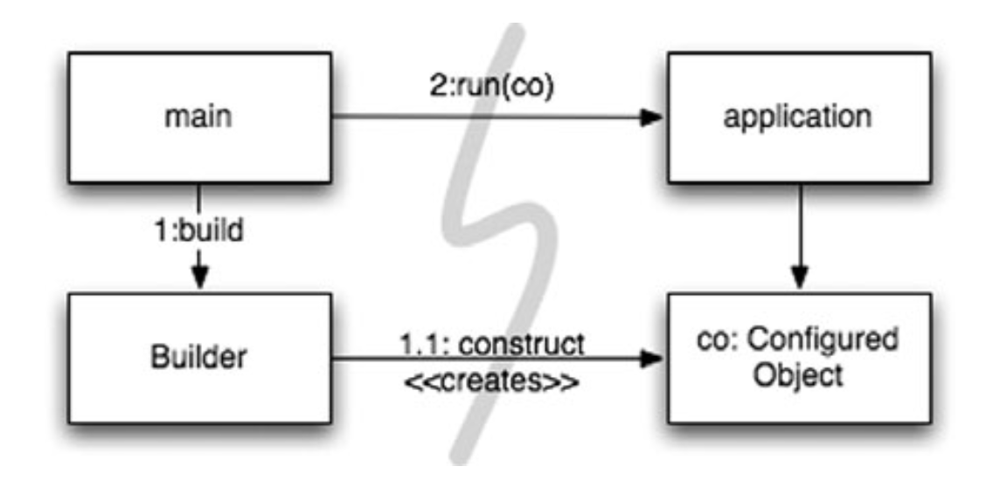
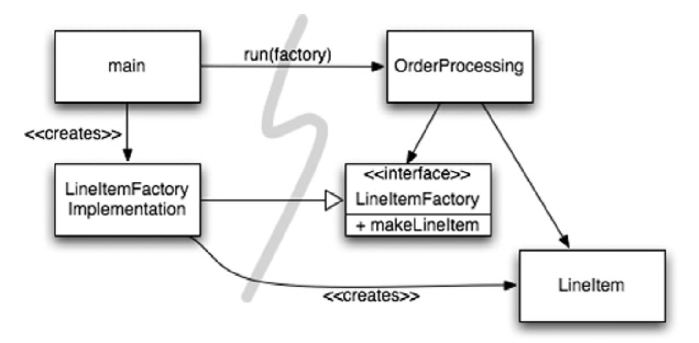

# Hệ thống
## bởi Tiến sĩ Kevin Dean Wampler

“Loại bỏ sự phức tạp. Nó bòn rút sự sống của các nhà phát triển, khiến các sản phẩm khó lên kế hoạch, xây dựng và thử nghiệm ”. —Ray Ozzie, CTO, Microsoft Corporation
## Bạn sẽ xây dựng một thành phố như thế nào?
Bạn có thể tự quản lý tất cả các chi tiết? Chắc là không. Ngay cả việc quản lý một thành phố hiện tại cũng là quá nhiều đối với một người. Tuy nhiên, các thành phố hoạt động (hầu hết thời gian). Chúng hoạt động vì các thành phố có các nhóm người quản lý các khu vực cụ thể của thành phố, hệ thống nước, hệ thống điện, giao thông, thực thi pháp luật, quy tắc xây dựng, v.v. Một số người chịu trách nhiệm về bức tranh toàn cảnh, trong khi những người khác tập trung vào các chi tiết.   

Các thành phố cũng hoạt động vì chúng đã phát triển các cấp độ **abstraction** và **mô đun** phù hợp để giúp các cá nhân và “bộ phận” mà họ quản lý làm việc hiệu quả, ngay cả khi không hiểu được bức tranh toàn cảnh.

Mặc dù các nhóm phần mềm cũng thường được tổ chức như vậy, nhưng các hệ thống mà họ làm việc thường không có sự tách biệt về mối quan tâm và mức độ **abstraction** giống nhau. Mã sạch sẽ giúp chúng tôi đạt được điều này ở mức độ **abstraction** thấp hơn. Trong chương này, chúng ta hãy xem xét cách duy trì sự sạch sẽ ở cấp độ **abstraction** cao hơn, cấp độ hệ thống.
## Tách biệt việc xây dựng một hệ thống với việc sử dụng nó
Đầu tiên, hãy xem xét rằng **xây dựng** là một quá trình rất khác với **sử dụng**. Khi tôi viết điều này, có một khách sạn mới đang được xây dựng mà tôi nhìn thấy qua cửa sổ của mình ở Chicago. Hiện tại nó là một khối bê tông với cần cẩu xây dựng và thang máy được bắt vít bên ngoài. Những người bận rộn ở đó đều đội mũ cứng và mặc quần áo lao động. Trong một năm hoặc lâu hơn, khách sạn sẽ được hoàn thành. Cần trục và thang máy sẽ không còn nữa. Tòa nhà sạch sẽ, được bao bọc trong các bức tường, cửa sổ bằng kính và sơn bắt mắt. Những người làm việc và ở đó trông cũng sẽ khác rất nhiều.

> Hệ thống phần mềm nên tách riêng quá trình khởi tạo, khi các đối tượng ứng dụng được xây dựng và các phần phụ thuộc được “kết nối” với nhau, khỏi runtime logic sau khi khởi tạo.

Quá trình khởi tạo là một **mối quan tâm** mà bất kỳ ứng dụng nào cũng phải giải quyết. Đó là **mối quan tâm** đầu tiên mà chúng ta sẽ xem xét trong chương này. **Tách các mối quan tâm** là một trong những kỹ thuật thiết kế lâu đời và quan trọng nhất trong nghề lập trình.

Thật không may, hầu hết các ứng dụng không tách biệt mối quan tâm này. Mã cho quá trình khởi tạo là đặc biệt và nó được trộn với runtime logic. Đây là một ví dụ điển hình:
```java
public Service getService() {
    if(service==null)
        service=new MyServiceImpl(...); // Good enough default for most cases?
        
    return service;
}
```
Đây là thành ngữ **LAZY INITIALIZATION/EVALUATION**, và nó có một số điểm đáng khen. Chúng ta không phải chịu chi phí xây dựng trừ khi chúng ta thực sự sử dụng đối tượng và do đó, thời gian khởi tạo có thể nhanh hơn. Chúng ta cũng đảm bảo rằng không bao giờ trả về **null**.

Tuy nhiên, bây giờ chúng ta có một sự phụ thuộc được hard-coded vào **MyServiceImpl** và mọi thứ mà hàm tạo của nó yêu cầu (mà tôi đã giải thích). Chúng ta không thể biên dịch mà không giải quyết các phần phụ thuộc này, ngay cả khi không bao giờ sử dụng một đối tượng nào khi chạy chương trình!

Kiểm tra có thể là một vấn đề. Nếu **MyServiceImpl** là một đối tượng nặng, cần đảm bảo rằng **TEST DOUBLE** hoặc **MOCK OBJECT** thích hợp được gán cho trường dịch vụ trước khi phương thức này được gọi trong quá trình kiểm tra đơn vị. Bởi vì, logic xây dựng trộn lẫn với xử lý runtime, chúng ta nên kiểm tra tất cả các đường dẫn thực thi (ví dụ: kiểm tra **null** và khối của nó). Có cả hai trách nhiệm này có nghĩa là phương pháp đang thực hiện nhiều hơn một việc, vì vậy chúng ta đang phá vỡ **Nguyên tắc Trách nhiệm Đơn lẻ** (SRP).

Có lẽ tệ nhất là chúng ta không biết liệu **MyServiceImpl** có phải là đối tượng phù hợp trong mọi trường hợp hay không. Tôi ngụ ý như trong **comment**. Tại sao lớp với phương thức này phải biết bối cảnh toàn cục? Có thể thực sự biết đối tượng phù hợp để sử dụng ở đây không? Liệu một loại có thể phù hợp với tất cả các ngữ cảnh có thể xảy ra không?

Tất nhiên, một lần xuất hiện LAZY-INITIALIZATION không phải là một vấn đề nghiêm trọng. Tuy nhiên, thông thường có **nhiều trường hợp** các thiết lập nhỏ như thế này xuất hiện trong ứng dụng. Do đó, việc thiết lập toàn cầu (nếu có) nằm rải rác trên ứng dụng, với ít mô đun và thường trùng lặp.

Nếu nghiêm túc về việc xây dựng các hệ thống tốt và mạnh mẽ, chúng ta không bao giờ nên để những cái lợi nhỏ dẫn đến việc phá vỡ mô-đun. Quá trình khởi tạo xây dựng đối tượng cũng không ngoại lệ. Nên mô-đun hóa quá trình này một cách riêng biệt với runtime logic thông thường và đảm bảo rằng có một chiến lược toàn cầu, nhất quán để giải quyết các phụ thuộc.
## Tách Main
Một cách để tách việc khởi tạo khỏi việc sử dụng, đơn giản là di chuyển toàn bộ việc khởi tạo sang **main**, hoặc các mô-đun được gọi bởi **main**, và thiết kế phần còn lại của hệ thống với giả định rằng tất cả các đối tượng đã được xây dựng và kết nối phù hợp (Xem Figure 11-1).   
**Figure 11-1**  
**Separating construction in main()**

Quy trình kiểm soát dễ dàng theo dõi. Hàm **main** xây dựng các đối tượng cần thiết cho hệ thống, sau đó chuyển chúng cho **application**, **application** chỉ việc sử dụng. Lưu ý hướng của các mũi tên phụ thuộc vượt qua rào cản giữa **main** và **application**. Tất cả đều đi về một hướng, hướng ra xa  **main**. Điều này có nghĩa là **application** không có kiến thức về  **main** hoặc về quá trình xây dựng. Nó chỉ đơn giản biết mọi thứ đã được xây dựng đúng cách.
## Factories
Tất nhiên, đôi khi chúng ta cần làm cho **application** chịu trách nhiệm về thời điểm một đối tượng được tạo. Ví dụ, trong một hệ thống xử lý đơn đặt hàng, **application** phải tạo các thể hiện **LineItem** để thêm vào **Order**. Trong trường hợp này, chúng ta có thể sử dụng mẫu ABSTRACT FACTORY để cung cấp cho **application** quyền kiểm soát thời điểm xây dựng các **LineItems**, nhưng giữ các chi tiết của cấu trúc đó tách biệt với mã **application** (Xem Figure 11-2).  
**Figure 11-2**    
**Separation construction with factory**  

Một lần nữa lưu ý rằng tất cả các phụ thuộc đều trỏ từ **main** đến ứng dụng **OrderProcessing**. Điều này có nghĩa là **application** được tách ra khỏi việc xây dựng **LineItem**. Khả năng đó được lưu giữ trong **LineItemFactoryImplementation**, nằm ở phía **main**. Tuy nhiên, **application**  hoàn toàn kiểm soát được thời điểm các instances **LineItem** được xây dựng và thậm chí có thể cung cấp các đối số hàm tạo dành riêng cho **application**.
## Dependency Injection
Một cơ chế mạnh mẽ để tách việc xây dựng khỏi việc sử dụng là **Dependency Injection** (DI), ứng dụng **Inversion of Control** (IoC) để quản lý sự phụ thuộc. Đảo ngược kiểm soát chuyển các trách nhiệm thứ cấp từ một đối tượng sang các đối tượng khác có mục đích chuyên biệt, do đó hỗ trợ **Nguyên tắc Trách nhiệm Đơn lẻ**. Trong bối cảnh quản lý phụ thuộc, một đối tượng không nên chịu trách nhiệm về việc khởi tạo các phụ thuộc. Thay vào đó, nó nên chuyển trách nhiệm này cho một cơ chế **“có thẩm quyền”** khác, do đó đảo ngược sự kiểm soát. Bởi vì thiết lập là mối quan tâm toàn cầu, cơ chế có thẩm quyền này thường sẽ là quy trình “main” hoặc một vùng chứa có mục đích đặc biệt.

Tra cứu JNDI là một triển khai **"partial"** của DI, trong đó một đối tượng yêu cầu một thư mục máy chủ cung cấp một **"service"** phù hợp với tên cụ thể.
```java
    MyService myService = (MyService) (jndiContext.lookup(“NameOfMyService”));
```
**Đối tượng gọi** không kiểm soát loại đối tượng nào được trả về (tất nhiên là miễn là nó triển khai interface thích hợp), nhưng **đối tượng gọi** vẫn tích cực giải quyết phụ thuộc.

True Dependency Injection tiến thêm một bước nữa. Hoàn toàn thụ động, lớp không trực tiếp giải quyết các phụ thuộc của nó. Thay vào đó, nó cung cấp các phương thức setter hoặc các đối số cho phương thức khởi tạo (hoặc cả hai) để chèn các phần phụ thuộc. Trong quá trình xây dựng, vùng chứa DI khởi tạo các đối tượng được yêu cầu (thường là theo yêu cầu) và sử dụng các đối số của phương thức khởi tạo hoặc phương thức setter được cung cấp để kết nối các phụ thuộc với nhau. Đối tượng phụ thuộc nào được sử dụng thực sự được chỉ định thông qua tệp cấu hình hoặc được lập trình trong mô-đun xây dựng đặc biệt.

Spring Framework cung cấp vùng chứa DI nổi tiếng nhất cho Java. Bạn xác định các đối tượng nào để kết nối với nhau trong tệp cấu hình XML, sau đó bạn yêu cầu các đối tượng cụ thể theo tên trong mã Java. Chúng ta sẽ xem xét một ví dụ ngay sau đây.

Nhưng còn LAZY-INITIALIZATION? Đôi khi nó vẫn hữu ích với DI. Đầu tiên, hầu hết các vùng chứa DI sẽ không tạo một đối tượng cho đến khi cần thiết. Thứ hai, nhiều vùng chứa này cung cấp các cơ chế để gọi factories hoặc để xây dựng proxy, có thể được sử dụng để LAZY-EVALUATION và tối ưu hóa.
## Mở rộng quy mô
Các thành phố phát triển từ các thị trấn & khu định cư. Lúc đầu, những con đường nhỏ hẹp và không tồn tại, sau đó chúng được trải nhựa, rồi được mở rộng theo thời gian. Các tòa nhà nhỏ và các mảnh đất trống được lấp đầy bởi các tòa nhà lớn, một số trong số đó cuối cùng sẽ được thay thế với những tòa nhà chọc trời.

Lúc đầu, không có các dịch vụ như điện, nước, thoát nước và Internet. Các dịch vụ này dần được bổ sung khi dân số và mật độ xây dựng tăng lên.

Sự phát triển này không phải là không **có sai lầm**. Đã bao nhiêu lần bạn lái xe, vượt qua một dự án “cải thiện” đường và tự hỏi mình, “Tại sao họ không xây dựng nó đủ rộng ngay từ đầu!?”

Nhưng nó không thể xảy ra theo bất kỳ cách nào. Ai có thể biện minh cho chi phí của một đường cao tốc sáu làn xuyên qua giữa một thị trấn nhỏ? Ai sẽ muốn một con đường như vậy qua thị trấn của họ?

Thật là hoang đường khi chúng ta có được hệ thống hoàn chỉnh “ngay lần đầu tiên”. Thay vào đó, chúng ta chỉ nên đề cập đến những vấn đề của ngày hôm nay, sau đó tái cấu trúc và mở rộng hệ thống để triển khai những vấn đề mới vào ngày mai. Đây là bản chất của sự lặp đi lặp lại và phát triển. Quá trình phát triển theo hướng thử nghiệm, tái cấu trúc và mã sạch mà họ tạo ra làm cho việc này hoạt động ở cấp mã.

Nhưng ở cấp độ hệ thống thì sao? Cấu trúc hệ thống không yêu cầu lập kế hoạch trước phải không? Chắc chắn, nó không thể tăng dần từ đơn giản đến phức tạp, phải không?
> Hệ thống phần mềm là duy nhất so với hệ thống vật lý. Các kiến trúc của chúng có thể phát triển từng bước, **nếu** chúng ta duy trì sự phân tách các mối quan tâm một cách thích hợp.

Bản chất thay đổi liên tục của các hệ thống phần mềm làm cho điều này trở nên khả thi, như chúng ta sẽ thấy. Trước tiên, hãy xem xét một ví dụ về một kiến trúc **không phân tách** các mối quan tâm một cách thỏa đáng.

Các kiến trúc EJB1 và EJB2 ban đầu đã không tách biệt các mối quan tâm một cách thích hợp và do đó áp đặt các rào cản không cần thiết. Hãy xem xét một thực thể **Bean** cho một lớp **Bank**. Một thực thể **bean** là một biểu diễn trong bộ nhớ của dữ liệu quan hệ, hay nói cách khác, là một hàng của bảng.

Đầu tiên, bạn phải xác định giao diện cục bộ (đang trong quá trình xử lý) hoặc giao diện từ xa (JVM riêng biệt), mà các ứng dụng khách sẽ sử dụng. Listing 11-1 cho thấy một giao diện cục bộ có thể có:   
**Listing 11-1**  
**An EJB2 local interface for a Bank EJB**
```java
package com.example.banking;

import java.util.Collections;
import javax.ejb.*;

public interface BankLocal extends java.ejb.EJBLocalObject {
    String getStreetAddr1() throws EJBException;

    String getStreetAddr2() throws EJBException;

    String getCity() throws EJBException;

    String getState() throws EJBException;

    String getZipCode() throws EJBException;

    void setStreetAddr1(String street1) throws EJBException;

    void setStreetAddr2(String street2) throws EJBException;

    void setCity(String city) throws EJBException;

    void setState(String state) throws EJBException;

    void setZipCode(String zip) throws EJBException;

    Collection getAccounts() throws EJBException;

    void setAccounts(Collection accounts) throws EJBException;

    void addAccount(AccountDTO accountDTO) throws EJBException;
}
```
Tôi đã hiển thị một số thuộc tính cho địa chỉ **Bank**’s và tập hợp các tài khoản mà ngân hàng sở hữu, mỗi thuộc tính sẽ được xử lý dữ liệu bởi một **Account** EJB riêng biệt. Listing 11-2 cho thấy lớp triển khai tương ứng cho **Bank**.   
**Listing 11-2**   
**The corresponding EJB2 Entity Bean Implementation**  
```java
package com.example.banking;

import java.util.Collections;
import javax.ejb.*;

public abstract class Bank implements javax.ejb.EntityBean {
    // Business logic...
    public abstract String getStreetAddr1();

    public abstract String getStreetAddr2();

    public abstract String getCity();

    public abstract String getState();

    public abstract String getZipCode();

    public abstract void setStreetAddr1(String street1);

    public abstract void setStreetAddr2(String street1);

    public abstract void setCity(String city);

    public abstract void setState(String state);

    public abstract void setZipCode(String zip);

    public abstract Collection getAccounts();

    public abstract void setAccounts(Collection accounts);

    public void addAccount(AccountDTO accountDTO) {
        InitialContext context = new InitialContext();
        AccountHomeLocal accountHome = context.lookup("AccountHomeLocal");
        AccountLocal account = accountHome.create(accountDTO);
        Collection accounts = getAccounts();
        accounts.add(account);
    }

    // EJB container logic
    public abstract void setId(Integer id);

    public abstract Integer getId();

    public Integer ejbCreate(Integer id) { ...}

    public void ejbPostCreate(Integer id) { ...}

    // The rest had to be implemented but were usually empty:
    public void setEntityContext(EntityContext ctx) {
    }

    public void unsetEntityContext() {
    }

    public void ejbActivate() {
    }

    public void ejbPassivate() {
    }

    public void ejbLoad() {
    }

    public void ejbStore() {
    }

    public void ejbRemove() {
    }
}
```
Tôi chưa hiển thị interface **LocalHome** tương ứng, về cơ bản là một factory được sử dụng để tạo các đối tượng, cũng như không có bất kỳ phương pháp tìm **Bank** (truy vấn) nào mà bạn có thể thêm vào.

Cuối cùng, bạn phải viết một hoặc nhiều bộ mô tả triển khai XML chỉ định chi tiết ánh xạ quan hệ đối tượng đến một kho lưu trữ liên tục, hành vi giao dịch mong muốn, các ràng buộc bảo mật, v.v.

Logic nghiệp vụ được kết hợp chặt chẽ với “container” ứng dụng EJB2. Bạn phải phân lớp các loại container và bạn phải cung cấp nhiều phương thức vòng đời mà container yêu cầu.

Do khớp nối này với thùng chứa nặng, việc kiểm tra đơn vị biệt lập rất khó khăn. Cần phải mô phỏng vùng chứa, điều này khó hoặc tốn nhiều thời gian triển khai các EJB và thử nghiệm cho một máy chủ thực. Việc sử dụng lại kiến trúc EJB2 bên ngoài có thể là một cách hiệu quả, do khớp nối chặt chẽ.

Cuối cùng, ngay cả lập trình hướng đối tượng cũng bị phá hủy. Một bean không thể kế thừa từ một bean khác. Lưu ý logic để thêm tài khoản mới. Thông thường trong các bean EJB2 là định nghĩa “các đối tượng truyền dữ liệu” (DTO) về cơ bản là “cấu trúc” không có hành vi. Điều này thường dẫn đến các kiểu dư thừa về cơ bản cùng giữ một dữ liệu và nó yêu cầu mã soạn sẵn để sao chép dữ liệu từ đối tượng này sang đối tượng khác.
## Mối quan tâm xuyên suốt
Kiến trúc EJB2 tiến gần đến sự tách biệt thực sự của các mối quan tâm trong một số lĩnh vực. Ví dụ: giao dịch mong muốn, bảo mật và một số hành vi liên tục được khai báo trong bộ mô tả triển khai, độc lập với mã nguồn.

Lưu ý rằng những mối quan tâm có xu hướng vượt qua ranh giới của đối tượng tự nhiên của **domain**. Bạn muốn duy trì tất cả các đối tượng của mình nói chung bằng cùng một cách, ví dụ: sử dụng một DBMS cụ thể so với một tệp phẳng, tuân theo các quy ước đặt tên nhất định cho các bảng và cột, sử dụng ý nghĩa giao dịch nhất quán của ngôn ngữ, v.v.

Về nguyên tắc, bạn có thể lập luận chiến lược **persistence** của mình theo mô-đun. Tuy nhiên, trong thực tế, về cơ bản bạn phải viết cùng một đoạn mã thực hiện chiến lược trên nhiều đối tượng. Chúng tôi sử dụng thuật ngữ mối quan hệ xuyên suốt cho những trường hợp như thế này. Một lần nữa, **persistence framework** có thể là mô-đun và domain logic của chúng tôi. Vấn đề là sự giao nhau giữa các domain này.

Trên thực tế, cách kiến trúc EJB xử lý tính **persistence**, bảo mật và giao dịch, lập trình hướng khía cạnh “được dự đoán trước” (AOP), là một cách tiếp cận có mục đích nhằm khôi phục mô-đun cho các mối quan hệ xuyên suốt.

Trong AOP, các cấu trúc mô-đun được gọi là các khía cạnh chỉ định điểm nào trong hệ thống cần được sửa đổi hành vi của chúng theo một cách nhất quán nào đó nhằm hỗ trợ một mối quan hệ cụ thể. Đặc tả này được thực hiện bằng cách sử dụng cơ chế khai báo hoặc lập trình rút gọn.

Sử dụng persistence làm ví dụ, bạn sẽ khai báo các đối tượng và thuộc tính (hoặc các mẫu của chúng) nên được duy trì và sau đó ủy quyền các nhiệm vụ persistence cho khung persistence của bạn. Các sửa đổi hành vi được thực hiện không xâm phạm đến mã đích bởi khung AOP. Chúng ta hãy xem xét ba khía cạnh hoặc các cơ chế giống như khía cạnh trong Java.


